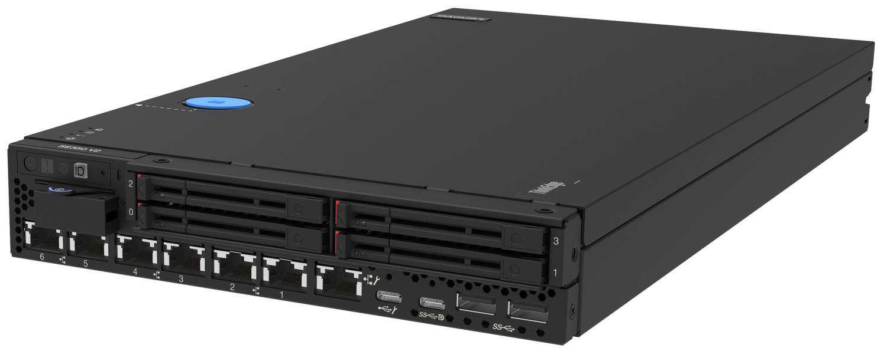
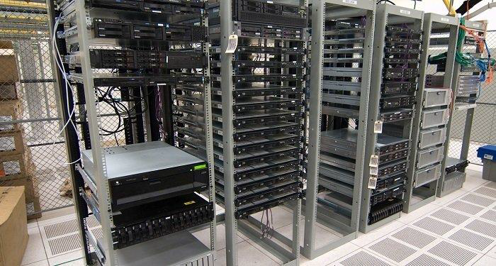
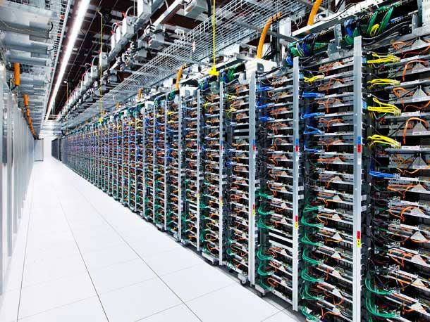
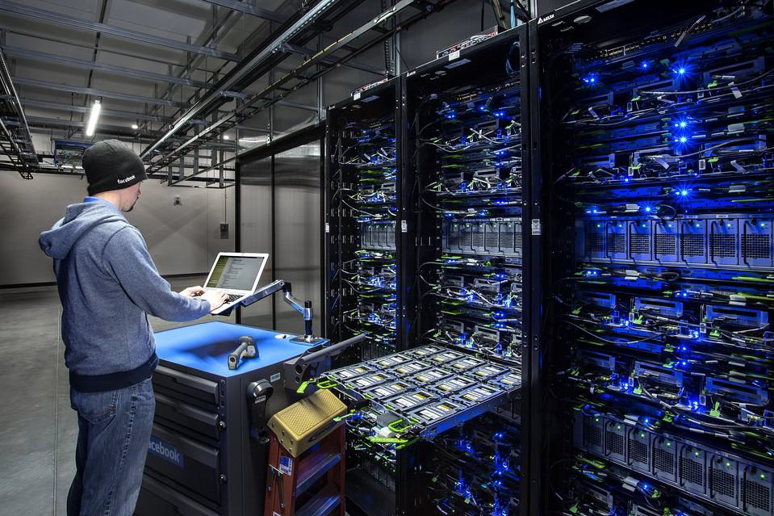

# Revolution in Cloud Computing

## True Revolution of Cloud Computing
Cloud Computing gained massive popularity because of ability of provision
servers on the go.

## What is a server?
A Server is similar to your Laptop in a sense that it has CPU, RAM, Storage
Disks
They are specially designed to operate 24/7 to run websites, serve requests etc.

## Typical Approach to Server
Servers are generally stacked in racks containing dedicated cooling systems,
power supply.

## What is Data Center?
A data center is a physical location that generally stores and runs hundreds to
thousands of servers based on requirements.

## Requirement - Hosting a Website
Requirement : Your company wants to host their website.
Standard Older Approach:
1. Choose the DataCenter / Hosting Provider
2. Send them enquiry about your requirements.
3. They will contact you and price negotiations.

## When issue arises, System Admin Runs

## Non-Cloud Model is Challenging
Due to some big promotion, server capacity needs to be increased from 4GB
RAM to 32 GB RAM

Cloud Provider Way: Resize the Server from Console.