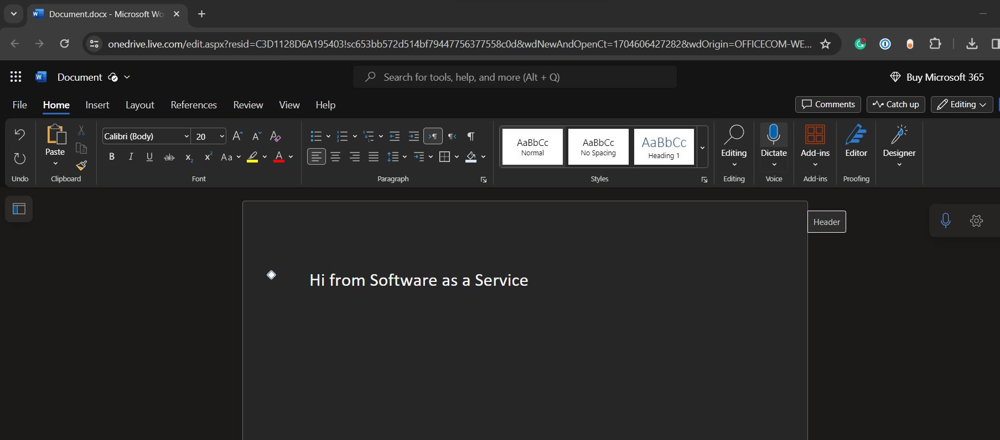
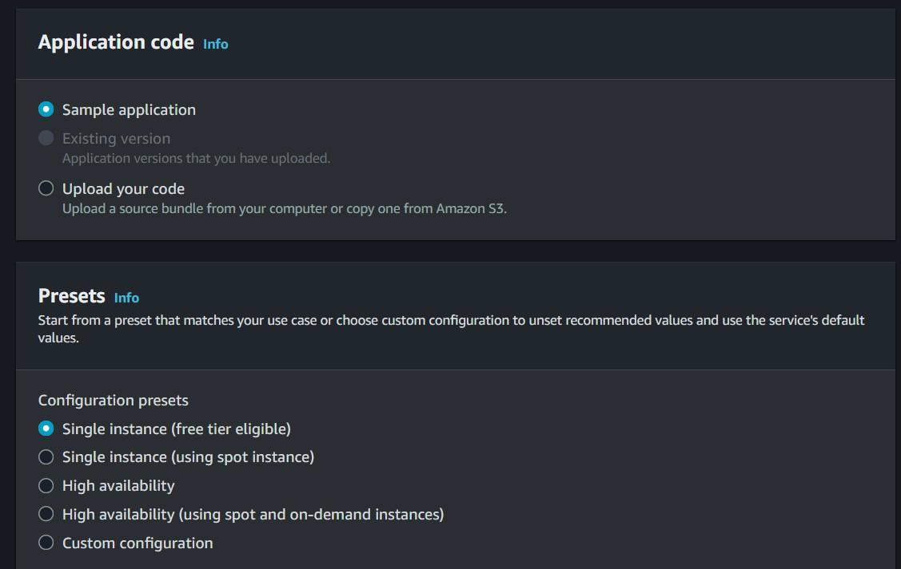

# Cloud Computing Models

Types of Cloud Computing Models
There are 3 types of Cloud Computing models

- Software as a Service (SAAS) [Google Docs, Office 365]
- Platform as a Service (PAAS) [Google App Engine]
- Infrastructure as a Service (IAAS) [ AWS, Azure, Digital Ocean]

## Software as a Service (SAAS)

Also referred to as “On-Demand Software”
Softwares are hosted by cloud service provider and users can use it on-demand.

## Infrastructure as a Service (IAAS)

Also referred to as Hardware as a Service
Offers essential compute, storage, and networking resources on demand, on a
pay-as-you-go basis.

## Platform as a Service (PAAS)

Offers a flexible, scalable cloud platform to develop, deploy, run, and manage
apps.

## 

## Important Learnings - 1

Depending on the Cloud Computing Model, the Cloud provider that you choose
will also change.
Some Cloud providers can offer all the IAAS, PAAS and SAAS related
capabilities.

## Important Learnings - 2

Organizations does not always rely on a single cloud provider for their needs.
Above is also a good practice and can help save costs.
The approach of using different cloud provider for achieving different needs is
referred to as Multi-Cloud