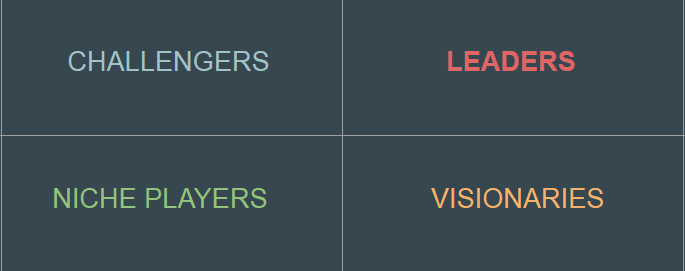
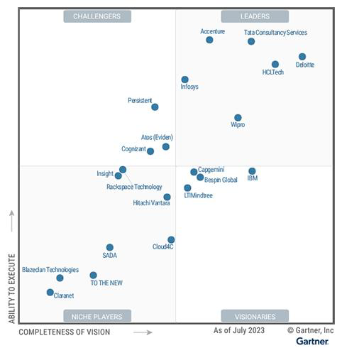
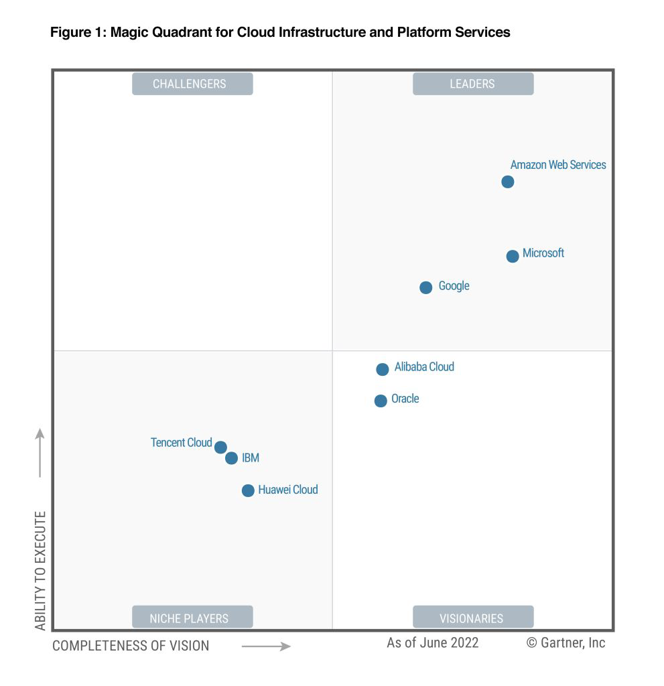
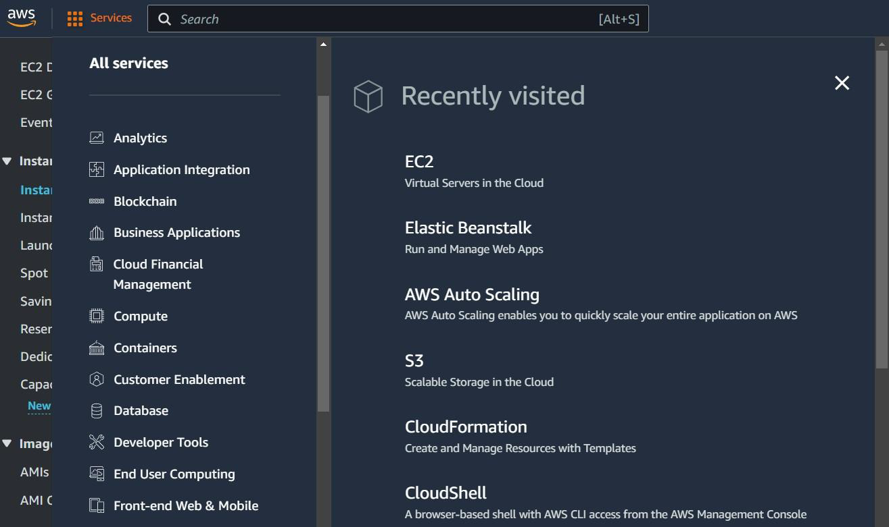
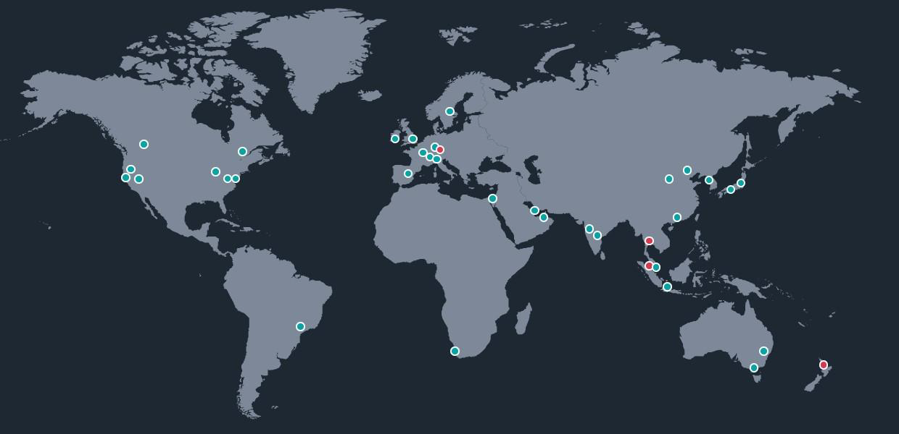

# Introduction to AWS

## Basics of Gartner Magic Quadrant

Gartner’s magic quadrant provides a graphical competitive positioning of four
types of technology providers in fast-growing markets.

## Example - Gartner Magic Quadrant

Area: Public Cloud IT Transformation Services

## Gartner Report - Cloud Infrastructure and Platform Services

## Introduction to AWS
Amazon Web Services (AWS) is the world’s most comprehensive and broadly
adopted cloud offering more than 200 services.
AWS has wide range of services for compute, storage, databases, encryption,
analytics, machine learning etc.

## Advantage - Big Global Footprint

AWS has more than 30+ regions available where customer can launch their
infrastructure on.

## Standard Pay As You Go Model
Pay only for what you use.
The model works based on per-hour / per-second billing.

