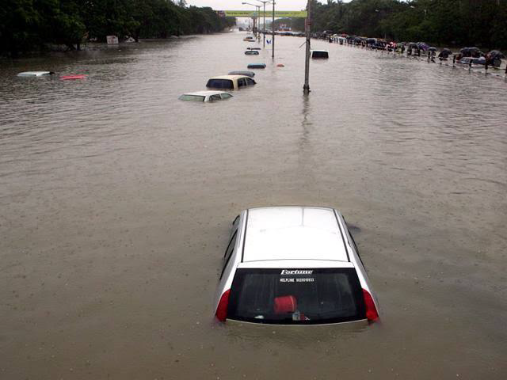
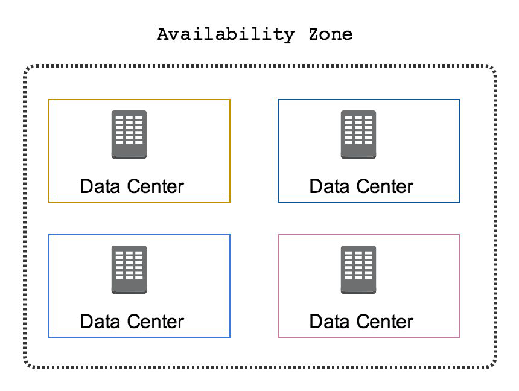
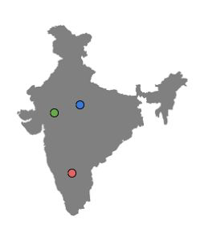
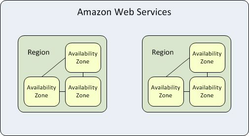

## AWS Data Centers
er typically has 1000s of servers.
What if data center goes down ?

</dive>

## Real World Scenarios

In Mumbai, there were very heavy rains in 2005.
Lot of people were affected.
Lot of Data Centers were also affected.

## Availability Zone

- AWS Data Centers are organized into Availability Zones (AZ)
- Each availability zone are located at lower-risk locations.
- There are multiple AZ and each of them is separate by geographic region
- Each AZ is designed for independent failure zone.
- Thus, they are physically separated.
- The AZ are inter-connected with high speed private links.
- Each availability zone are located at lower-risk locations.

## AWS Regions
knowledge portal
- Each region contains two or more availability zones.
- AWS has 22 number of regions worldwide and the number keeps increasing.

