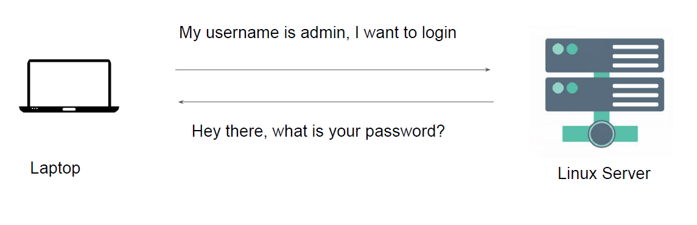
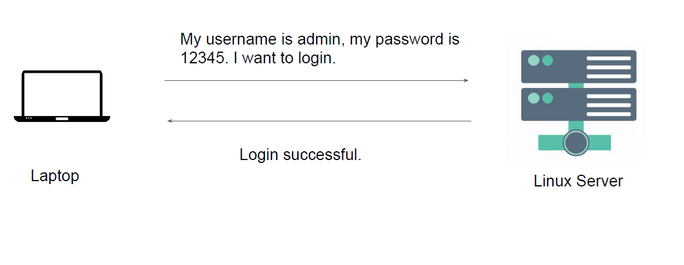
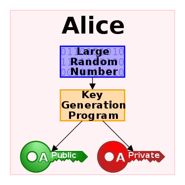
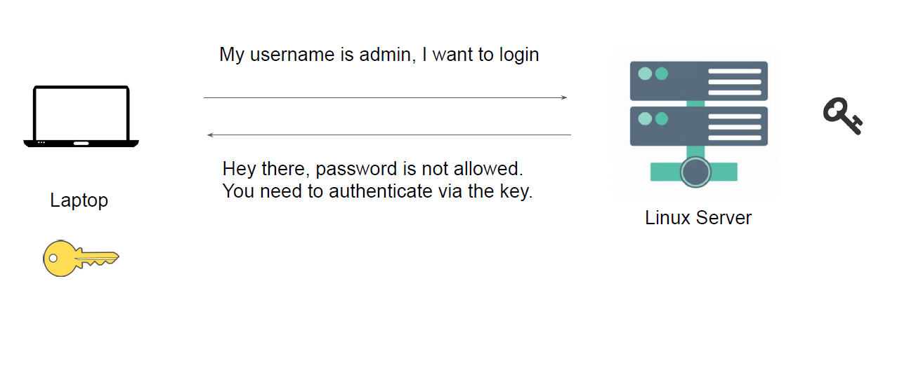

# Key Based Authentication

## Password Based Authentication
knowledge portal
There can be multiple methods for authentication against a system.
Password based authentication is the simplest form.

</dive>

</dive>

## Challenges with Password Based Authentication

knowledge portal
Password based authentication is generally considered to be less-secure.
Many users write down the passwords in notepad files or as part of sticky notes.
Most users would not create a complex password that is difficult to hack.

</dive>

## Key Based Authentication
knowledge portal
In this type of authentication, there are two special keys that are generated.
One key is called as Public Key and second key is called as Private key.
If public key is stored in server and is used as authentication mechanism, only the
corresponding private key can be used to successfully authenticate.

</dive>

</dive>