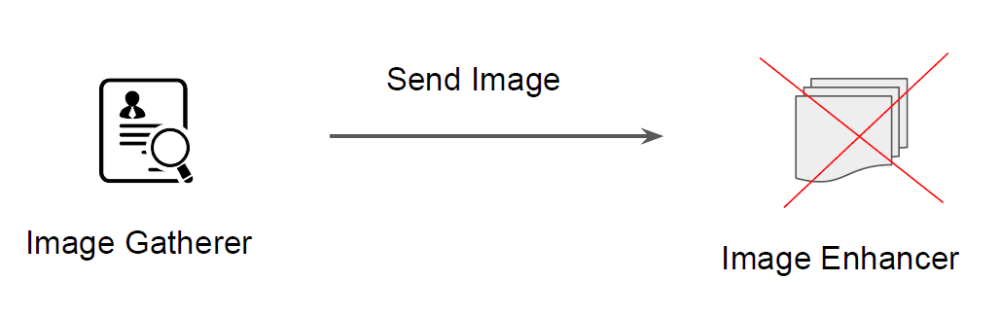

# Intro to Amazon SQS

##Use-Case: Restoring Image Application
knowledge portal
Medium Corp is designing an application that will enhance and restore the images that
users submit through the online portal.

# Current Architecture
knowledge portal
The overall architecture involves two components:
1. Image Gatherer - Takes the Images from the user via Upload button.
2. Imager Enhancer - Receives the Image from Image Gatherer.

## Challenges
Due to popularity of the application and huge traffic spike, Medium Corp has decided to
add more image enhancer servers.

## Better Architecture

knowledge portal
One of the main function of message queue service is to take message from a Publisher
and forward that to a consumer.
The queue stores these messages internally.

## Introduction to SQS
knowledge portal
Amazon SQS is a fast reliable, scalable, and fully managed message queuing service.
Amazon SQS makes it simple and quiet cost effective to decouple the components of a
specific application.

## Tightly Coupled Systems
knowledge portal
Components of system architecture directly communicate with each other and have
hard-dependency on each other.

## Loosely Coupled System
knowledge portal
Components of system architecture that can process the information without being
directly connected.

