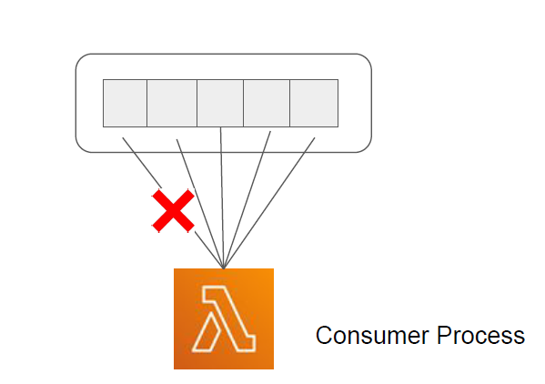
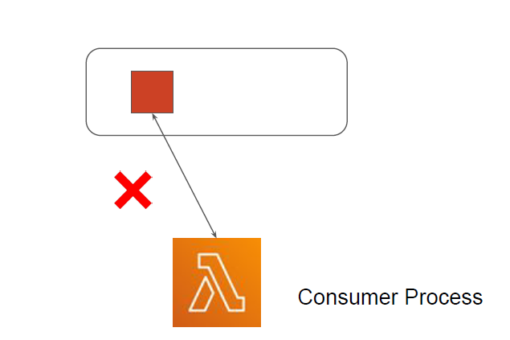
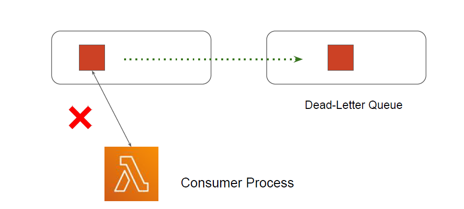
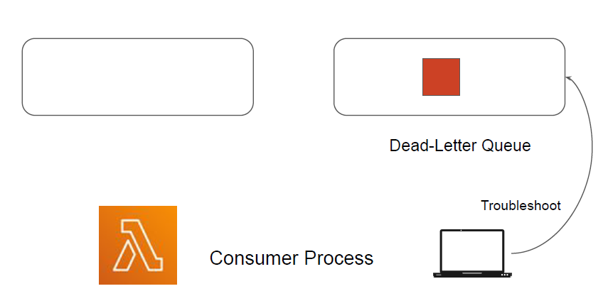

# SQS Dead-Letter Queues

## Understanding the Challenge

knowledge portal
Amazon SQS supports dead-letter queues, which other queues (source queues) can target for
messages that can't be processed (consumed) successfully.

   

## Moving to Dead-Letter Queue
knowledge portal
Move the message that cannot be processed to dead letter queue.

Move the the message that cannot be processed to dead letter queue.

## Overview of Dead Letter Queue
knowledge portal
Amazon SQS supports dead-letter queues, which other queues (source queues) can target for
messages that can't be processed (consumed) successfully
Dead-letter queues are useful for debugging your application or messaging system because
they let you isolate problematic messages to determine why their processing doesn't succeed.
The messages are sent to the dead letter queue after exceeding maximum receives.