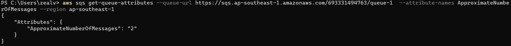

# Scaling based on Amazon SQS

In many scenarios, the number of EC2 instances that are required directly
correlates with number of messages in SQS queue.
If number of messages increases in SQS, there would be a need to increase
EC2 instances.

## Scaling based on Amazon SQS
We can configure Auto-Scaling group to launch or terminate EC2 instances
based on the number of messages in the SQS queue.
SQS Attribute to check: ApproximateNumberOfMessages

