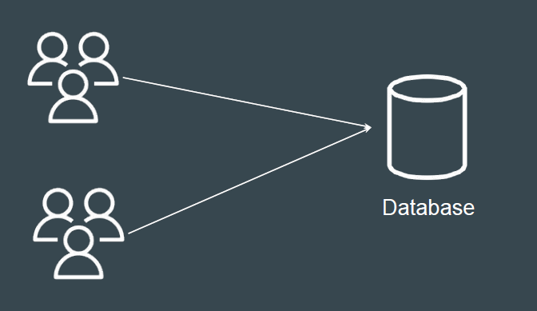
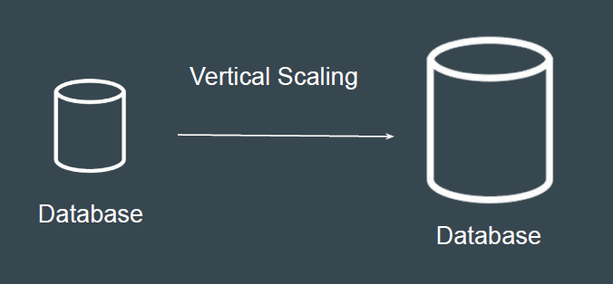
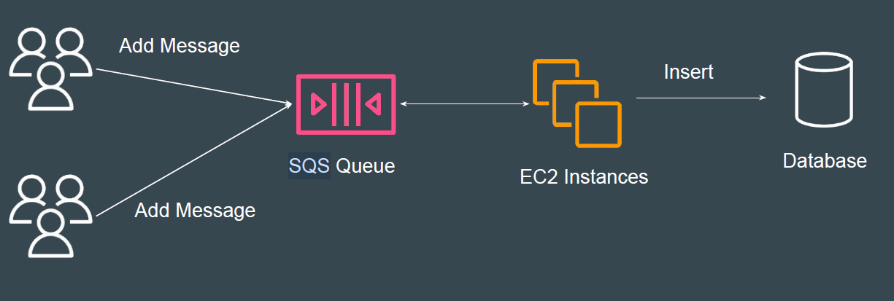

# Message Queues in Database Transactions

## Understanding with a Use-Case
- Let’s assume you have a single database hosted on RDS.
- Due to sales, the number of write transactions has reached 20x normal load.
- Many requests are failing regularly.
- New sale promotions are scheduled every alternate month.

## Possible Solution - Vertical Scaling
Increase the DB Instance Size of RDS and Provisioned IOPS to handle 20x
capacity
Challenge: Downtime + Increased Cost

## Better Approach - Add a Queue
In this approach, the messages are temporarily stored in SQS queue which can
handle nearly infinite messages.

