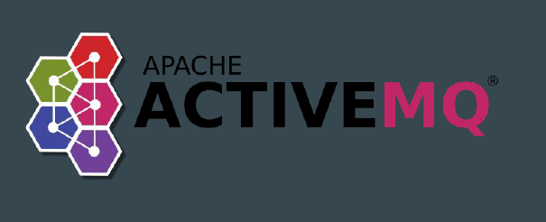
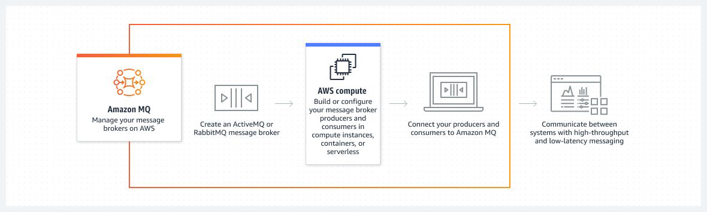
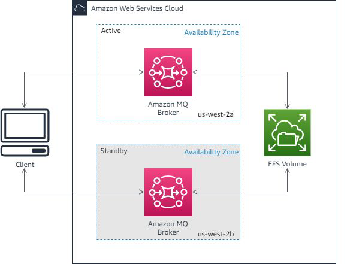

# Amazon MQ

## Current Stage
SQS is a simple queuing service.
Limited set of functionalities.
There are various Message Broker services like Apache Active MQ that
provides many set of features that are extensively used in on-premise
organizations.

## Moving to MQ
If you're using messaging with existing applications, and want to move your
messaging to the cloud quickly and easily, we recommend you consider
Amazon MQ.

## Pointers to Note
If you are building brand new applications in the cloud, AWS recommends you
consider Amazon SQS and Amazon SNS.
Amazon SQS and SNS are lightweight, fully managed message queue and
topic services that scale almost infinitely and provide simple, easy-to-use APIs

## Active/standby broker for high availability
An active/standby broker is comprised of two brokers in two different Availability
Zones, configured in a redundant pair.
Data is written on the shared EFS Volume.

