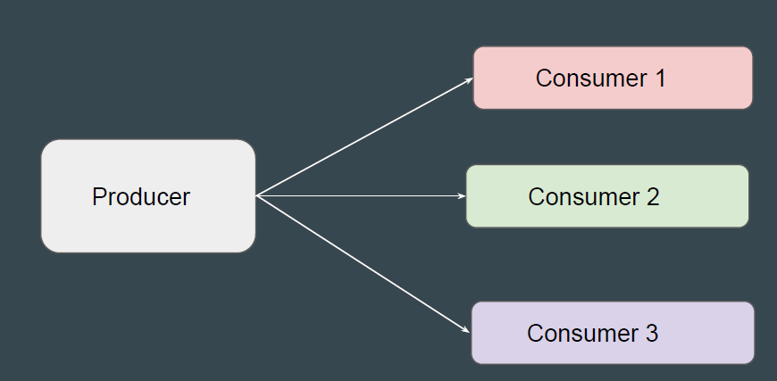
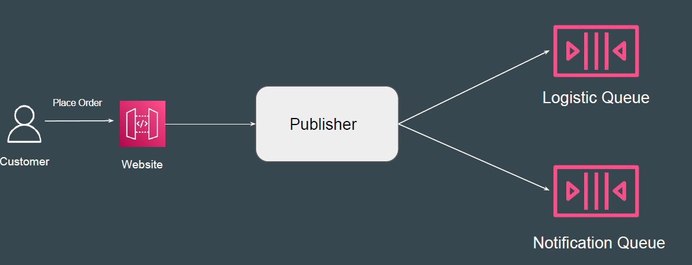
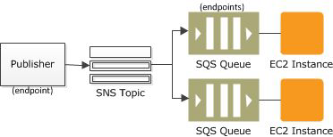
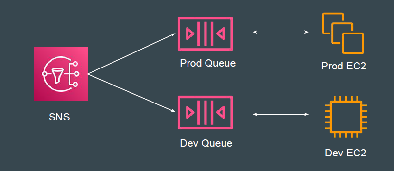

## Basics of Fanout Pattern
Fanout is a pattern in which message is delivered to multiple destinations.

## Simple Use-Case: Ordering a Product
Fanout is a pattern in which message is delivered to multiple destinations.

## SNS Fanout Pattern
The Fanout scenario is when a message published to an SNS topic is
replicated and pushed to multiple endpoints, such as Kinesis Data Firehose
delivery streams, Amazon SQS queues, HTTP(S) endpoints, and Lambda
functions.

## Another Use-Case
You can also use fanout to replicate data sent to your production environment
with your test environment
In production, you can attach a new SQS queue for test environment and can
continue to improve and test your application using data received from your
production environment.

