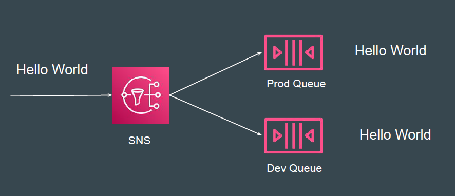

# SNS Message Filtering

## Revising the Basics
By default, an Amazon SNS topic subscriber receives every message that's
published to the topic.

## Basics of SNS Filtering
A filter policy is a JSON object containing properties that define which
messages the subscriber receives

