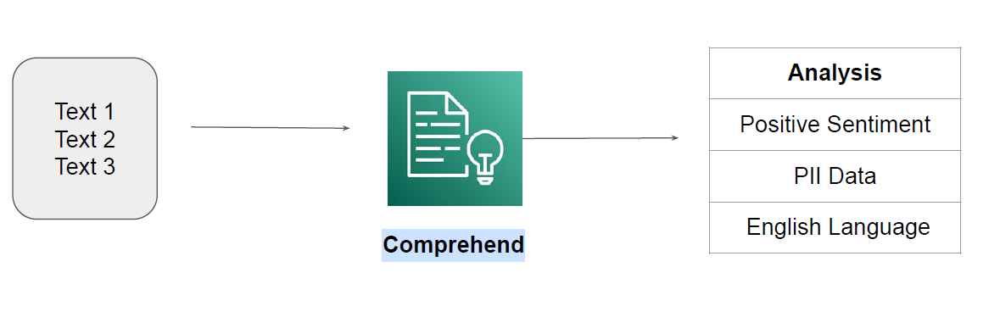

# Amazon Comprehend

## Simple Use-Case
There are 100 customer representatives working in a call center.
All the conversation is recorded into text (speech to text converter)
Management wants to know the overall sentiment of conversation (positive/negative).

Amazon Comprehend is a natural-language processing (NLP) service that uses machine learning
to uncover valuable insights and connections in text.

## Amazon Comprehend - Medical
Amazon Comprehend Medical is a HIPAA-eligible NLP service that uses machine learning to
understand and extract health data from medical text, such as prescriptions, procedures, or
diagnoses.