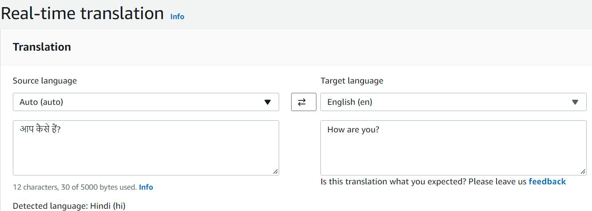
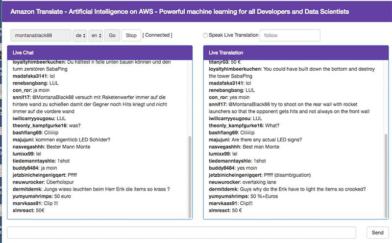

# Amazon Translate

## Understanding the Basics
Amazon Translate is a neural machine translation service that delivers fast, high-quality,
affordable, and customizable language translation.

## Sample Use-Case - Chat Application
You can translate messages in real-time based received on services like Twitch.

