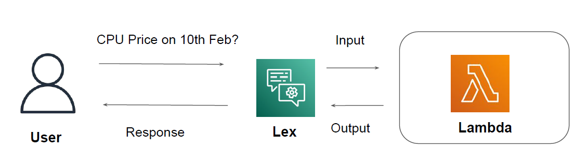

# Basic of Amazon Lex
Amazon Lex is a fully managed AI service with advanced natural language models to design,
build, test, and deploy conversational interfaces in applications.

# Integration with Lambda
Amazon Lex can also be integrated with Lambda Function to achieve a specific use-case.

