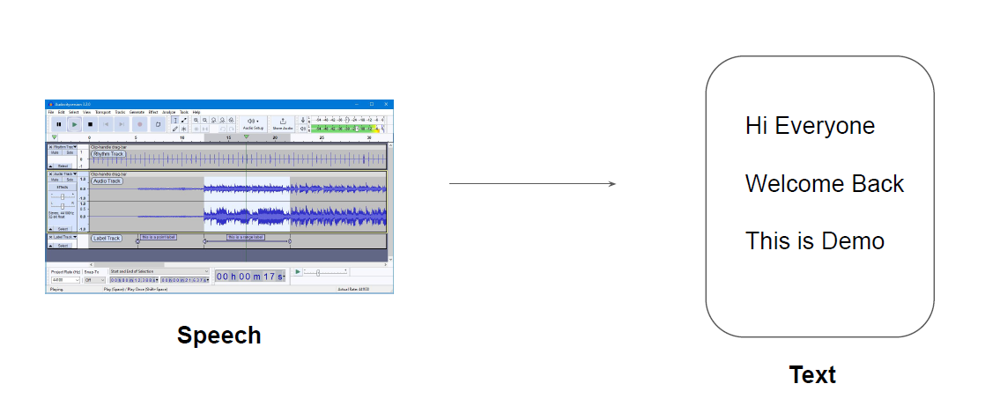

# Understanding the Basics
Amazon Transcribe is an automatic speech recognition service that uses machine learning
models to convert audio to text.

Call Analytics
Amazon Transcribe Call Analytics allows organizations to gain insight into customer-agent
interactions. Call Analytics provides you with:
1. Call characteristics, including talk time, non-talk time, speaker loudness, interruptions,
   and talk speed
2. Speaker sentiment for each caller at various points in a call
3. Call summarization, which detects issues, action items, and outcomes