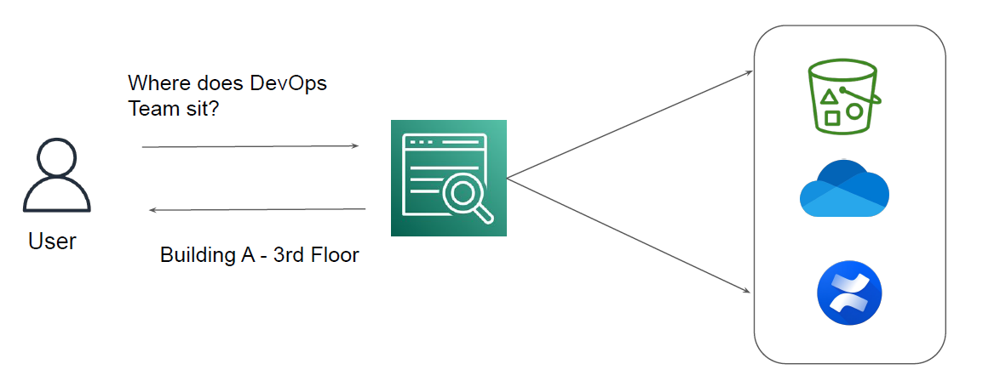

# Understanding the Basics
Amazon Kendra is a highly accurate and intelligent search service that enables your users to
search unstructured and structured data using natural language processing and advanced search
algorithms.

