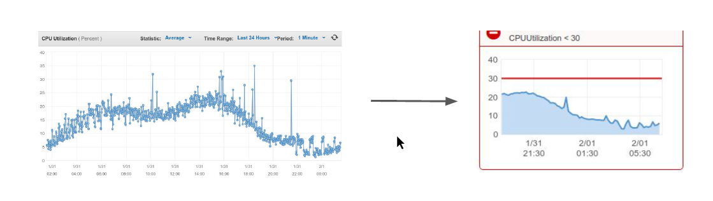

# Basics of CloudWatch

CloudWatch is a Monitoring service for your AWS Cloud Resources & Applications.
We can use CloudWatch to collect and monitor log files, set alarms and also automatically react
to changes in the AWS Resources.

