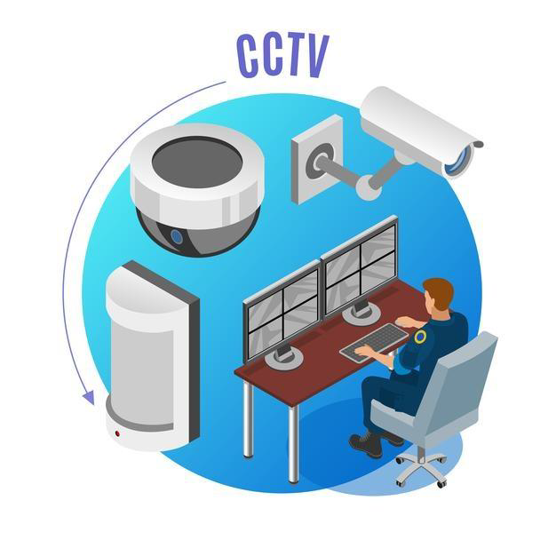
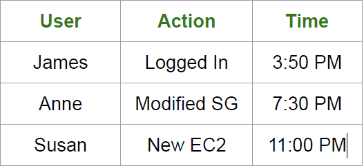
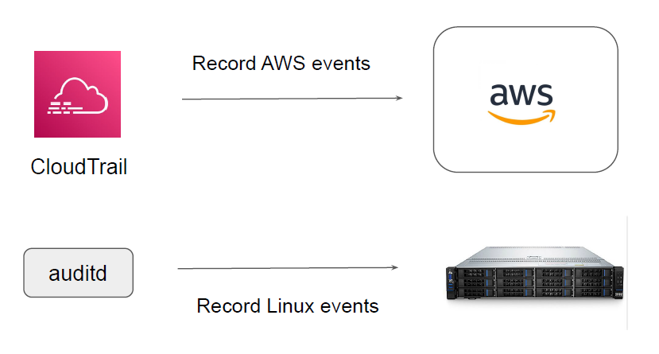

# CloudTrail

## Importance of Recording Everything

Installing video surveillance systems allows us to monitor activities round the clock and
provides lots of benefits, some of these include:

- Deterring Criminals
- Helps in Investigation.
- Regular monitoring of activities.
- Insurance Benefits.

## Recording at AWS Level

It is VERY important for organizations to record the activities that happen within the
Infrastructure as well as the servers.
Example Auditor Question :-
Show me what did Anne did on 3rd of January 2017 between 10 AM to 2 PM.

## Tools for Recording

Depending on the type of resource you use, the tools for recording might also change.

