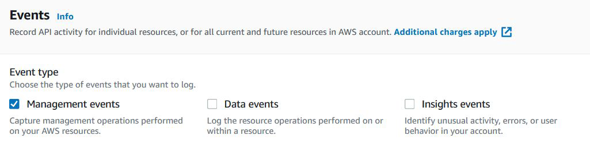
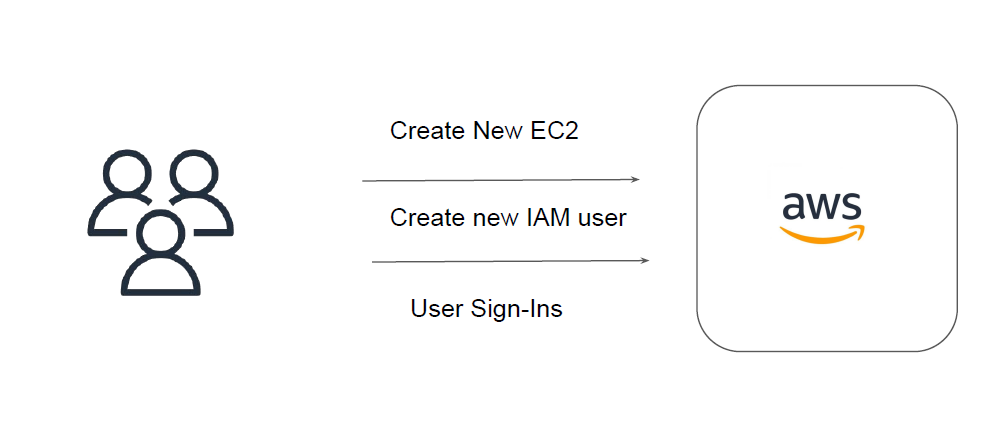
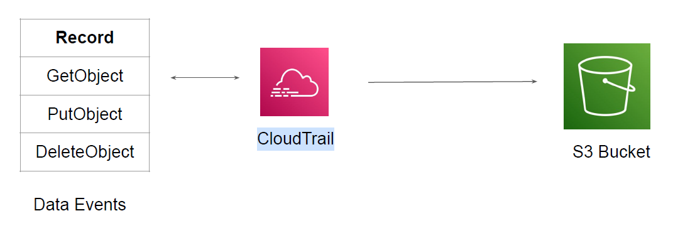
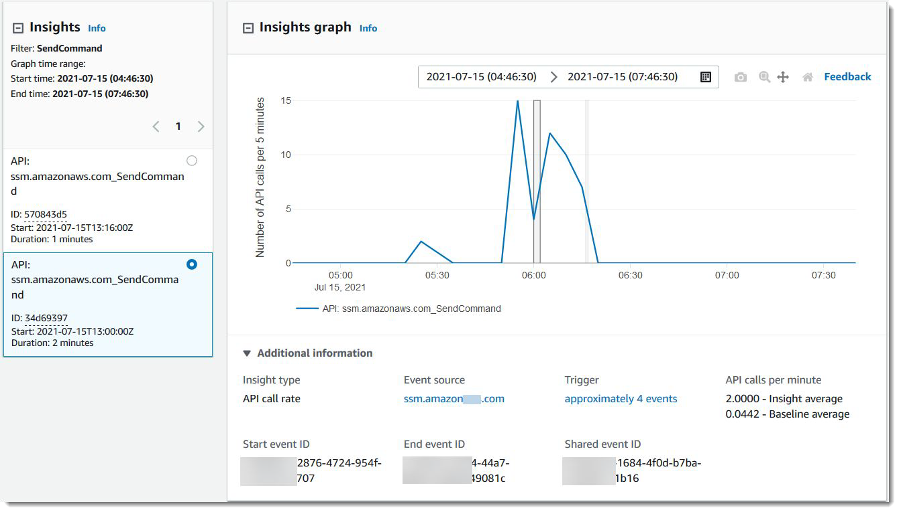

# CloudTrail Event Types

## Type of Events

There are three types of events that can be logged in CloudTrail:
1. Management events
2. Data events
3. Insights events.
By default, trails log management events, but not data or Insights events.

## 1. Management Events

Management events provide information about management operations that are performed on
resources in your AWS account.

## 2. Data Events

Data events provide information about the resource operations performed on or in a resource
and are are often high-volume activities.
Following diagram shows type of events capture at S3 level when Data events is enabled.

## 3. Insights Events

Insight Events helps customers identify unusual operational activity in their AWS accounts such
as spikes in resource provisioning, bursts of AWS Identity and Access Management (IAM)
actions
Is designed to automatically analyze management events to establish a baseline for normal
behavior, and then raise issues by generating Insights events when it detects unusual patterns.

