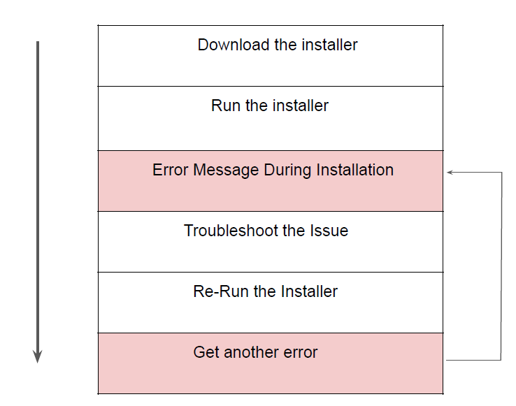
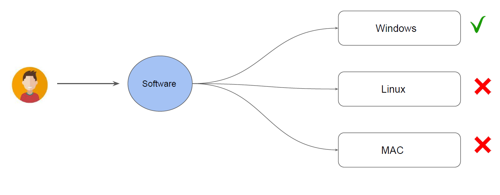
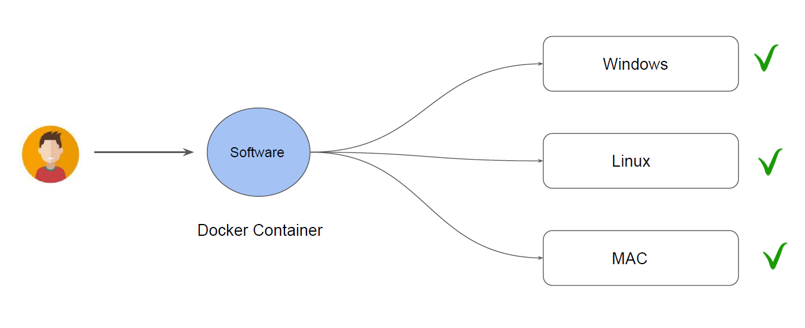

# Introduction to Docker

## Installation of Software Workflow

## What is Docker Trying to Achieve?

## Introduction

Docker is an open platform, once we build a docker container, we can run it anywhere, say
it windows, linux, mac whether on laptop, data center or in cloud.
It follows the build once, run anywhere approach.

