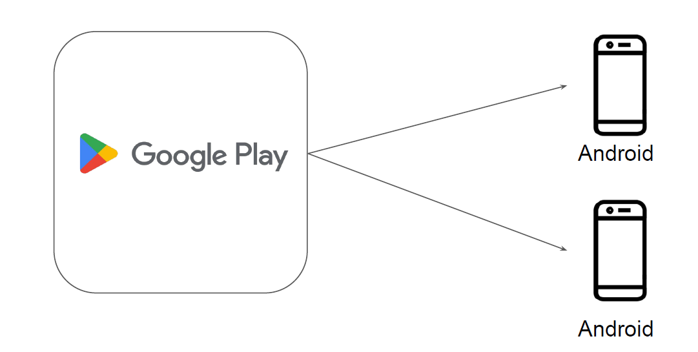
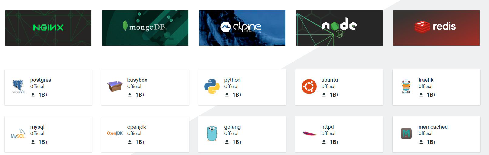
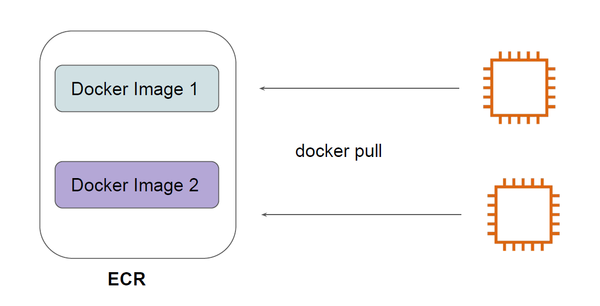

# Elastic Container Registry (ECR)

## Understanding with Analogy

Google Play is an online store where people go to find their favorite apps, games, movies,
TV shows, books, and more

## Importance of Container Registry

Container Registry is a single place for your team to manage Docker images.
Whenever you launch a Docker Container, the associated image is pulled from Registry.

## Basics of ECR

Amazon ECR is a fully managed container registry for storing Docker Images.

