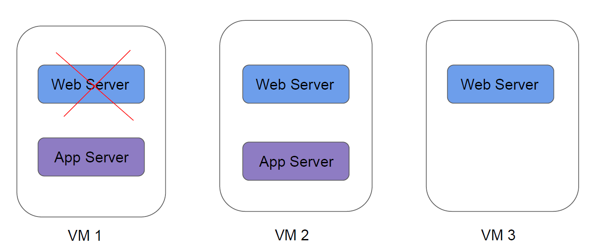

# Container Orchestration
Build once, use anywhere

Container orchestration is all about managing the life cycles of containers, especially in
large, dynamic environments.

## Importance of Container Orchestration

- Provisioning and deployment of containers
- Scaling up or removing containers to spread application load evenly
- Movement of containers from one host to another if there is a shortage of resources
- Load balancing of service discovery between containers
- Health monitoring of containers and hosts

## Container Orchestration Solutions
knowledge portal
There are many container orchestration solutions which are available, some of the popular
ones include:
- Docker Swarm
- Kubernetes
- Apache Mesos
- Elastic Container Service (AWS ECS)

There are also various container orchestration platforms available like EKS.