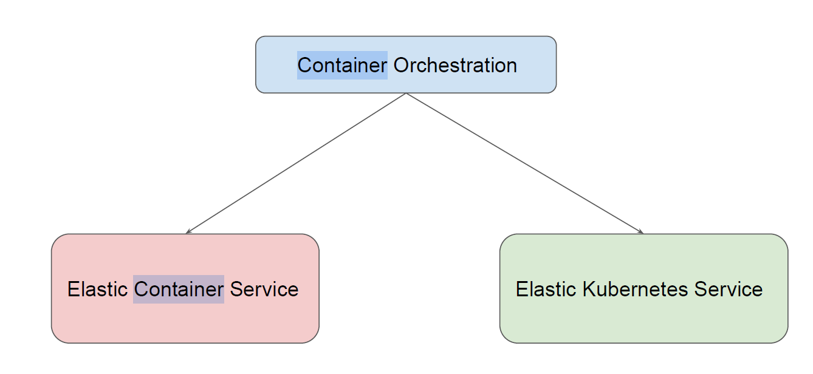

# Container Orchestration in AWS

There are two primary services that are extensively used for container orchestration use-cases.

| **Pointers**         | **AWS EKS**       | **AWS ECS**       |
|----------------------|-------------------|-------------------|
| **Open-Source**      | Yes               | No                |
| **Complexity**       | More Complex      | Less Complex      |
| **Community Support**| More              | Less              |

# Choosing Right Orchestrator

If you plan to work exclusively on AWS, you should choose ECS as it offers more in-depth AWS
integration than Amazon EKS.
Organizations with limited expertise and insufficient resources to invest in learning Kubernetes
can go with ECS.
If you plan to deploy containers across multiple platforms, you can choose EKS.