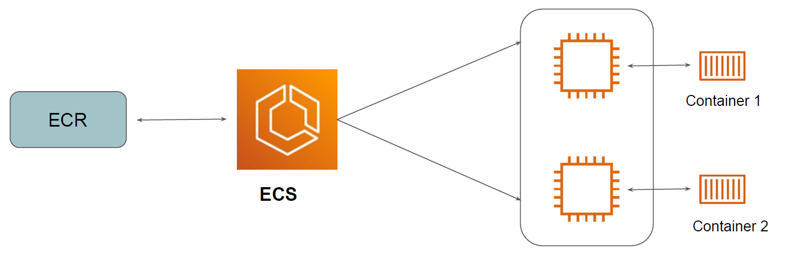
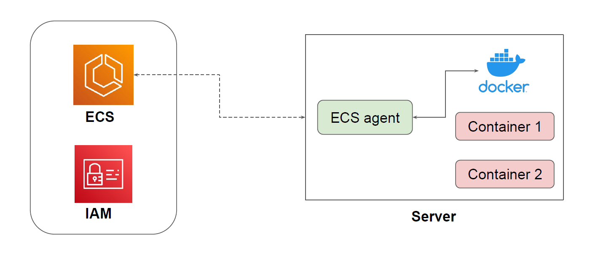

# Elastic Container Service (ECS)

Amazon Elastic Container Service (Amazon ECS) is a highly scalable and fast container
management service.
You can use it to run, stop, and manage containers on a cluster.

