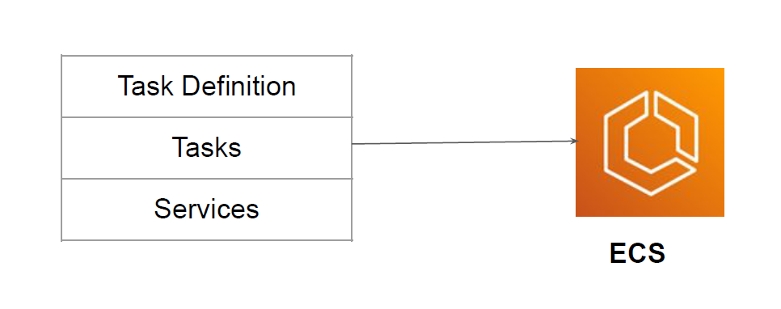
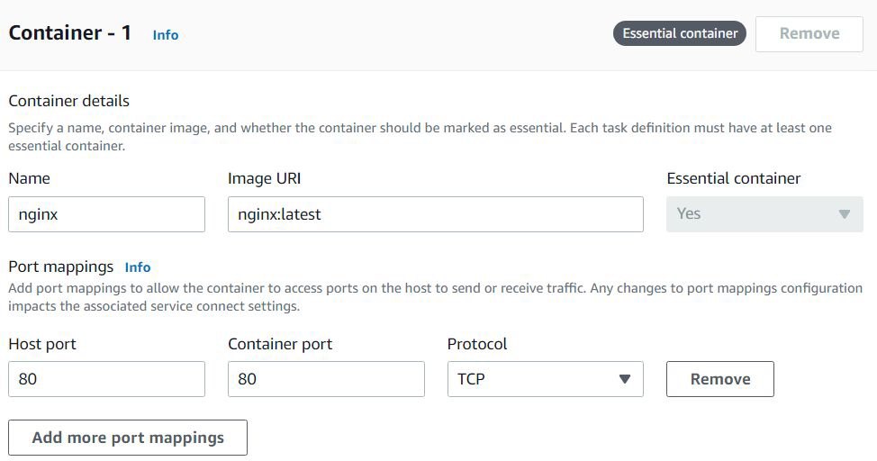
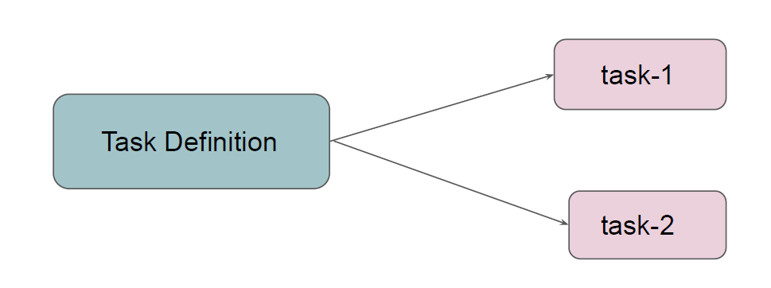
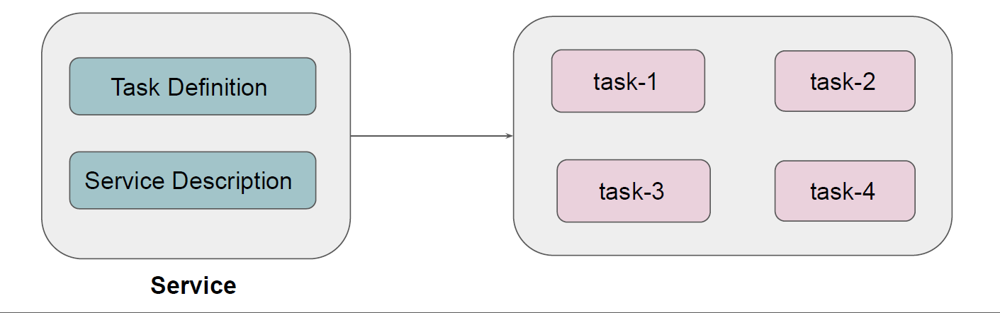

# Components of ECS

There are three primary components of ECS Cluster:
Task Definition, Tasks and Service

## Component - Task Definition
knowledge portal
A task definition is a text file that describes one or more containers that form your
application.
It contains information like operating system, containers to use, ports to open, storage

## Component - Task
knowledge portal
A task is the instantiation of a task definition within a cluster.
After you create a task definition for your application within Amazon ECS, you can
specify the number of tasks to run on your cluster.

## Component - Service

knowledge portal
Service to run and maintain your desired number of tasks simultaneously in an Amazon
ECS cluster.
If any of your tasks fail or stop for any reason, the Amazon ECS service scheduler launches
another instance based on your task definition

