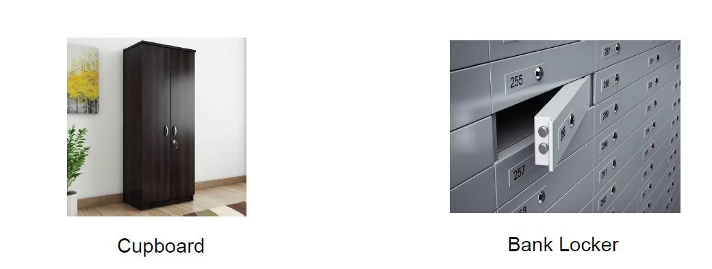
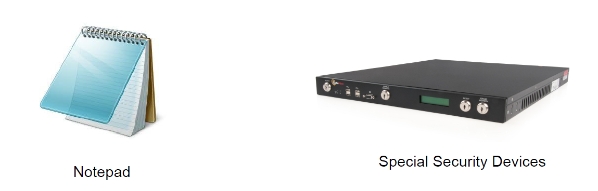
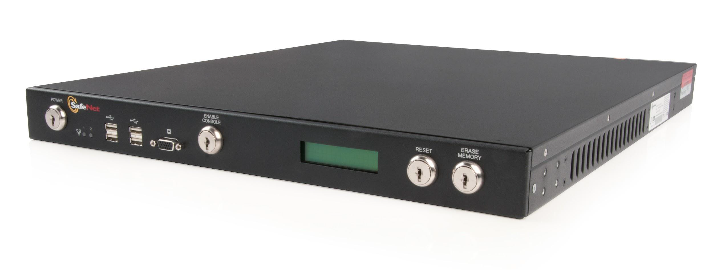
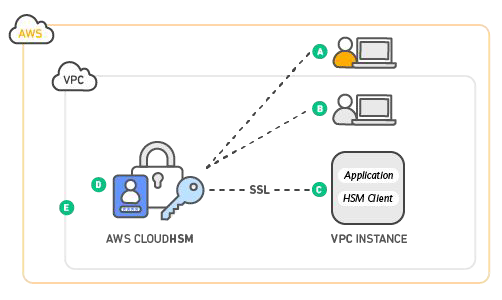

# CloudHSM

## Storing Expensive House Hold Items

You have an expensive jewellery in your house and you are planning to go on a long
vacation.
Where will you prefer to store the jewellery?

## Storing Sensitive Digital Keys

knowledge portal
You have sensitive encryption keys that needs to be stored
Where will you prefer to store the keys?

## Special Security Device - HSM

knowledge portal
A hardware security module (HSM) is a physical device that provides extra security for
sensitive data
This type of device is used to provision cryptographic keys for critical functions such as
encryption, decryption and authentication for the use of applications, identities and
databases.

## Tamper Resistant

knowledge portal
These devices are tamper resistant , that means if anyone tries to tamper, they will
automatically delete the keys stored.

## CloudHSM

AWS CloudHSM is a cloud-based hardware security module (HSM).
With CloudHSM, you can manage your own encryption keys using FIPS 140-2 Level 3
validated HSMs.
Prior to this, company’s had to store HSM on-premise and if infrastructure was on AWS,
there were lot of latency involved.

