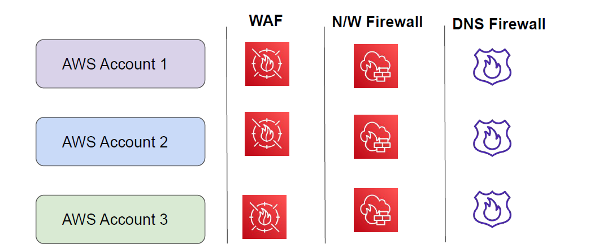

# Firewall Manager

# Understanding the Challenge

Most of the organizations are opting for Multi-Account based strategy for separation of
environments (dev, stage, prod)
Security Team needs to create, maintain and update security services across all of the accounts.

AWS Firewall Manager is a security management service which allows you to centrally configure
and manage firewall rules across your accounts and applications in AWS Organizations

# Supported Service
Firewall Manager supports wide variety of services, including:
- AWS WAF
- VPC Security Groups
- AWS Network Firewall
- Route53 DNS Firewall
- AWS Shield Advanced
- Palo Alto Cloud Next-generation firewalls

Important Prerequisite: AWS Organizations + AWS Config.

Benefits of Firewall Manager

1. Simplify management of firewall rules across your accounts

2. Ensure compliance of existing and new applications

3. Easily deploy managed rules across accounts

4. Centrally deploy protections for your VPCs