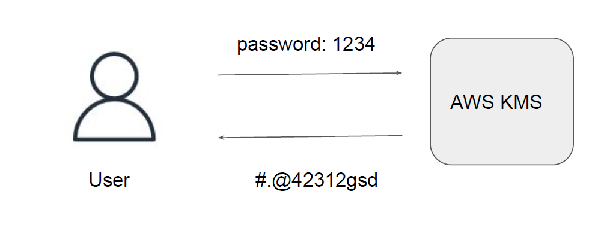
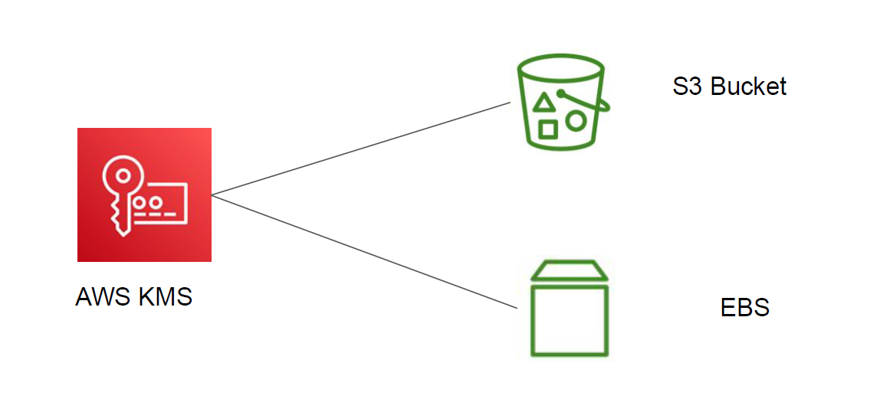

## Basics of KMS

knowledge portal
AWS KMS stands for AWS Key Management Service.
This service provides capability to encrypt and decrypt the data.

## Integration of KMS
knowledge portal
AWS KMS also integrates with various AWS services like S3, DynamoDB, EBS and others.

