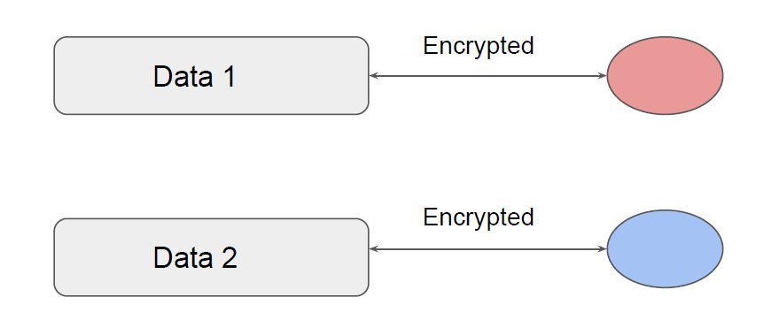

## What’s the Need ?

## Let’s be Proactive

## S3 also needs Encryption

AWS S3 offers multiple approaches to encrypt the data being stored in S3.

i) Server Side Encryption
- Request Amazon S3 to encrypt your object before saving it on disks in its data
centers and then decrypt it when you download the objects.
ii) Client Side Encryption
- Encrypt data client-side and upload the encrypted data to Amazon S3. In this case,
you manage the encryption process, the encryption keys, and related tools.

## Server Side Encryption
knowledge portal
Within Server-Side encryption, there are three options that can be used depending on the
use-case.
- Server-Side Encryption with Amazon S3-Managed Keys (SSE-S3)
- Server-Side Encryption with Customer Master Keys (CMKs) Stored in AWS Key
Management Service (SSE-KMS)
- Server-Side Encryption with Customer-Provided Keys (SSE-C)

## SSE with Amazon S3-Managed Keys (SSE-S3)

knowledge portal
i) Server-Side Encryption with Amazon S3-Managed Keys (SSE-S3)
● In this approach, each object is encrypted with a unique key.
● Uses one of the strongest block ciphers to encrypt the data, AES 256.

## SSE with CMK (SSE-KMS)
knowledge portal
ii) Server-Side Encryption with CMKs Stored in AWS Key Management Service (SSE-KMS)
Encrypting data with own CMK allows customers to create, rotate, disable customer
managed CMK’s. We can also define access controls and enable auditing.

## SSE with Customer-Provided Keys (SSE-C)

knowledge portal
Allows customers to set their own encryption keys.
Encryption key needs to be provided as part of the request and S3 will manage both the
encryption as well as the decryption options.

