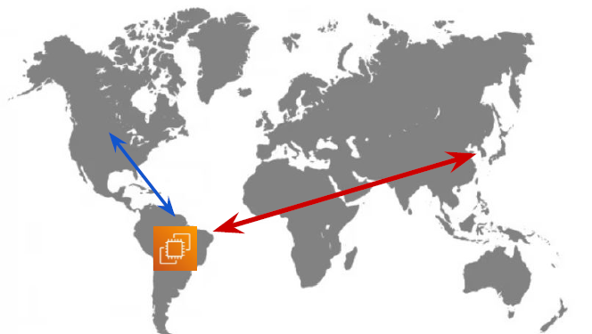
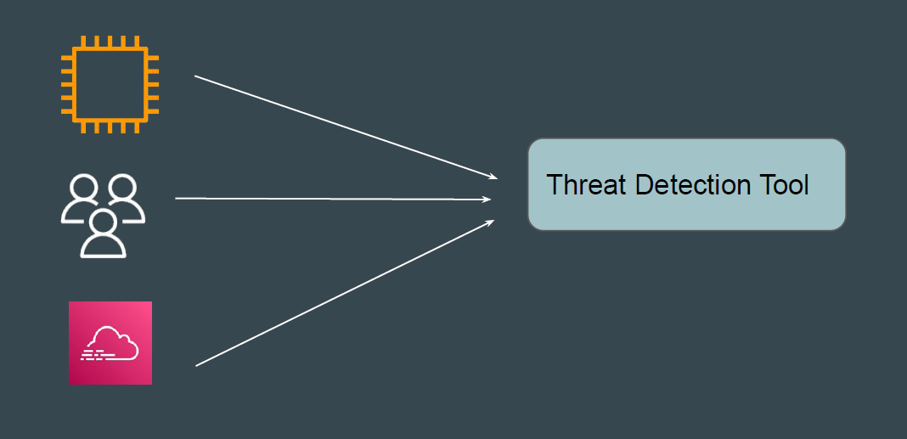
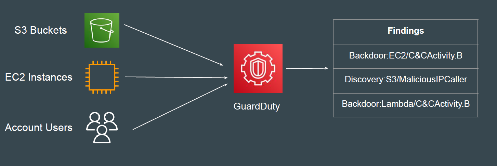
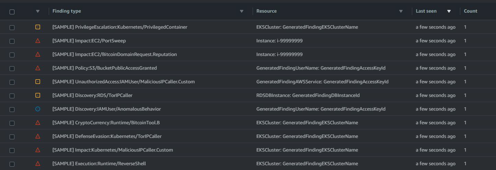

# Amazon GuardDuty

## Basics of Threat Detection
Threat detection is an organization's ability to monitor events in the environment
and detect real security incidents.
1. A Prod server always connects to services in US region.
2. There is a communication between Prod Server & North Korea.

## Important Requirement for Threat Detection

One of the important requirement for Threat Detection is that appropriate level of
logs and events are needed for analysis to work.

## Understanding the Challenge
One of the primary challenge is the implementation of threat detection solution.
Organization have to configure appropriate set of tools and configure logging
and create necessary level of rules for detection.
The above point is not an issue for mid to large sized organization but difficult to
implement for smaller organizations due to resource constraints.

## Introducing Amazon GuardDuty
Amazon GuardDuty is a threat detection service that continuously monitors for
malicious activity and unauthorized behavior to protect your Amazon Web
Services accounts, workloads, and data stored in Amazon S3

## Sample GuardDuty Findings

## Supported Resource Types
A GuardDuty finding represents a potential security issue detected within your
network.
Following are the supported types of findings available:
- EC2 finding types
- EKS Runtime Monitoring finding types
- IAM finding types
- Kubernetes audit logs finding types
- Lambda Protection finding types
- Malware Protection finding types
- RDS Protection finding types
- S3 finding types

## Which Logs Are Analyzed By Default?
When you enable GuardDuty in your AWS account, GuardDuty automatically
starts to monitor these log sources.
1. AWS CloudTrail event logs
2. AWS CloudTrail management events
3. VPC Flow Logs
4. DNS logs