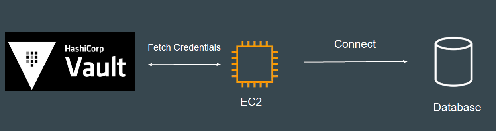
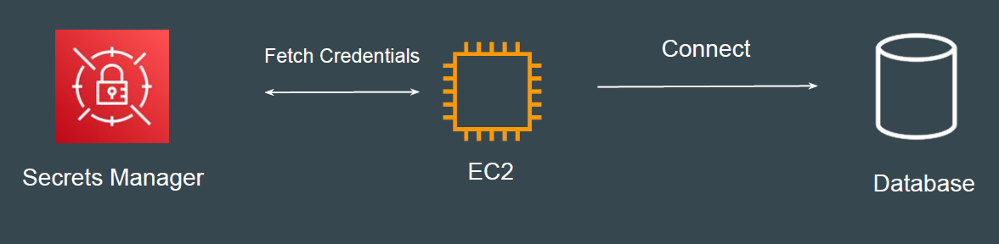

# AWS Secrets Manager

## Understanding the Challenge
In many organizations, secrets are hard coded directly as part of the application.
If you want to rotate the secret credential, all the application server needs to be
updated. If you miss one, the production can go down.

## Introducing Secrets Management
Secret management is a practice that allows developers to securely store
sensitive data, such as passwords, keys, and tokens, in a secure environment
with strict access controls.
Popular Tools: HashiCorp Vault, AWS Secrets Manager

## Introduction to Topic
AWS Secrets Manager helps you manage, retrieve, and rotate database
credentials, API keys, and other secrets throughout their lifecycles.

## Rotate AWS Secrets Manager secrets
Rotation is the process of periodically updating a secret.
Secrets Manager rotation uses an AWS Lambda function to update the secret
and the database.
To rotate a secret, Secrets Manager calls a Lambda function according to the
schedule you set up. You can set a schedule to rotate after a period of time, for
example, every 30 days.