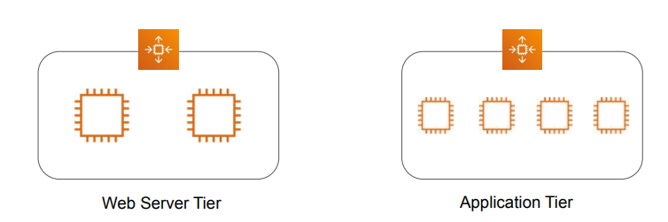

## Getting Started 
In Security Group rules, along with IP addresses, we can also refer to the security group of the 
destination EC2 instances.
This is a good practice specifically when using EC2 instances in auto-scaling group.

## Solution 
Create two security groups: 1st for Web Servers and 2nd for Application Servers.
Let’s assume following are the security group id’s assigned:
i) Web Servers: sg-web
ii) App Servers: sg-app

| SG Rule | Role                | Allowed Rule                  |
|---------|----------------------|--------------------------------|
| 1       | Web Server Instances| Outbound Port 8080 to sg-app |
| 2       | App Instances       | Inbound 8080 from sg-web     |

## Referencing SG Across VPC Peering

Security Group can be referenced across VPC Peering connections as well.
If there are two VPC’s in a peering connection in the same region, then we can reference by 
security group id’s from the peer VPC.

## Cross-Account SG Reference
To reference a security group in another AWS account, include the account number in Source 
or Destination field
other-aws-account-id/account-security-group-id
Example Rule:
123456789012/sg-1a2b3c4d
You cannot reference the security group of a peer VPC that's in a different region. Instead, use 
the CIDR block of the peer VPC.