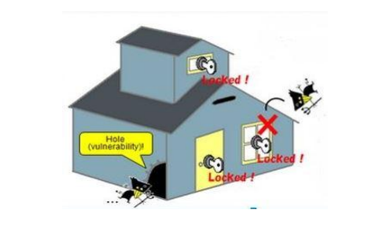
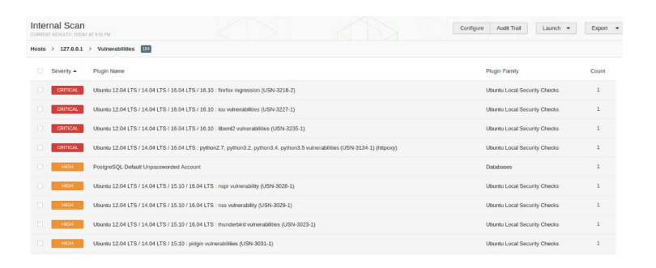

# Vulnerability, Exploit, Payload

## The simple house terminology

Vulnerability : Hole on the Side of the House

Exploit : The Robber 

Payload : What Robber does inside the house

## Security Terminology

Vulnerability :- Bad Software Code
Exploit :- Program that exploits code to get inside.
Payload :- Stealing Data, Ransomwares etc.

## Scan Result of Vulnerability Scanners

