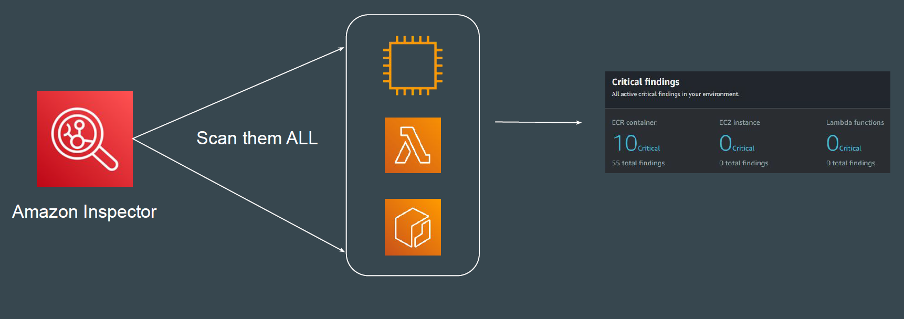
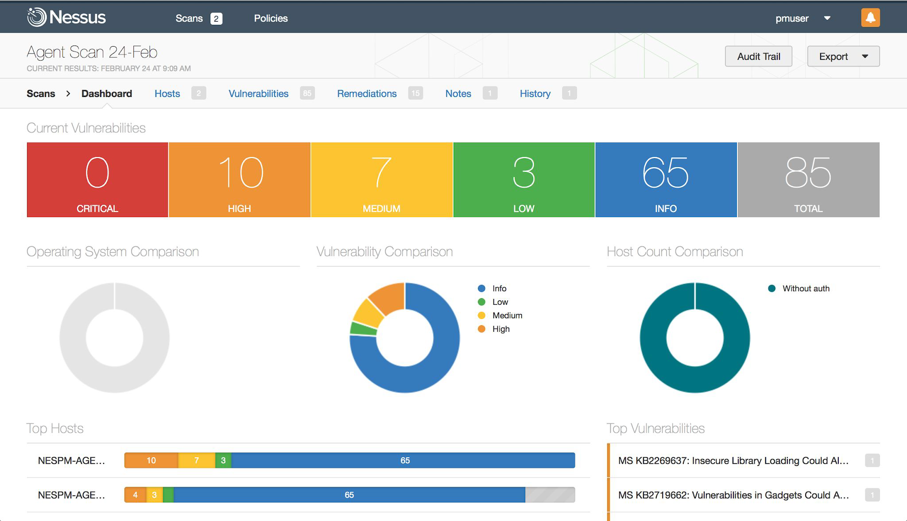

# Amazon Inspector

 ## Basics of AWS Inspector
Amazon Inspector is an automated vulnerability management service that
continually scans AWS workloads for software vulnerabilities and unintended
network exposure.

## Similar to Nessus

Supported Resource Types
AWS Inspector can scan wide variety of AWS workloads.
These include:
- EC2 Instances.
- ECR Repositories
- Lambda Functions