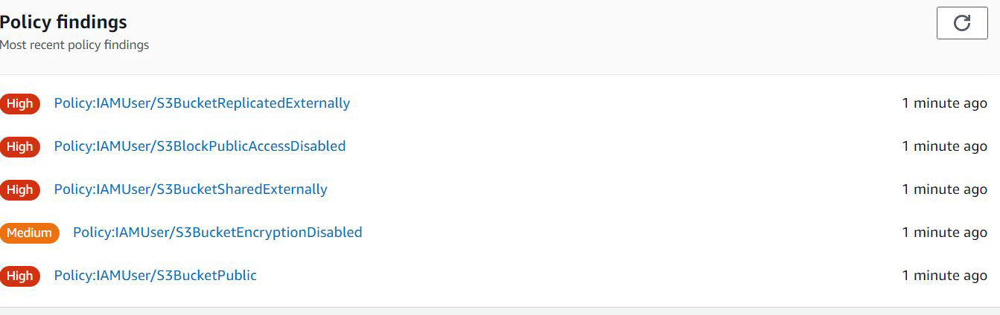

# Amazon Macie
"Machine Learning based Security"

## Core Feature of Macie
knowledge portal
S3 might contain sensitive information like PII data, database backups, SSL private keys and
various others.
Amazon Macie makes use of machine learning to identify sensitive data stored in AWS.

