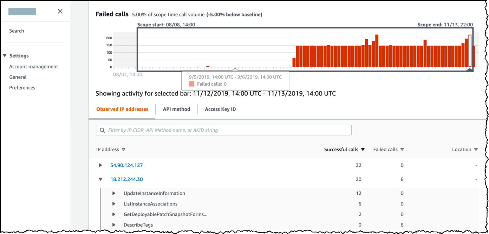

# Amazon Detective

## Basics of Amazon Detective

Amazon Detective makes it easy to investigate, analyze, and quickly identify the root cause of
potential security issues or suspicious activities.

## Important Note

Amazon Detective is a threat detection service that continuously monitors for malicious
activity and unauthorized behavior to protect your AWS accounts and workloads.
Amazon Detective enables you to analyze and visualize security data from your AWS
CloudTrail logs, VPC Flow logs, and Amazon GuardDuty findings.
Amazon Detective pricing is based on the volume of data ingested from AWS CloudTrail logs,
Amazon VPC Flow Logs, and Amazon GuardDuty findings. You are charged per Gigabyte
(GB) ingested per account/region/month