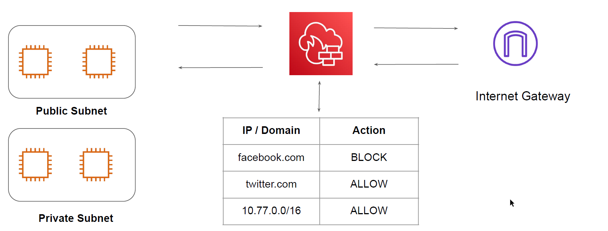

## Basics of Network Firewall

AWS Network Firewall is a stateful, managed, network firewall and intrusion detection and
prevention service for your virtual private cloud (VPC)

## benefits of Network Firewall
You can use Network Firewall to monitor and protect your Amazon VPC traffic in a number of
ways, including the following:
1. Pass traffic through only from known AWS service domains or IP address endpoints, such
as Amazon S3.
2. Use custom lists of known bad domains to limit the types of domain names that your
applications can access
3. Perform deep packet inspection on traffic entering or leaving your VPC