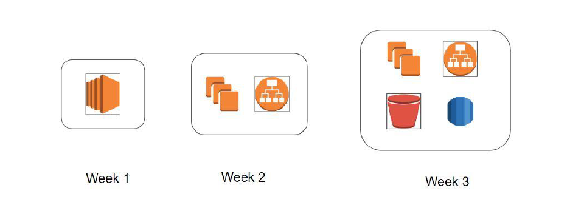
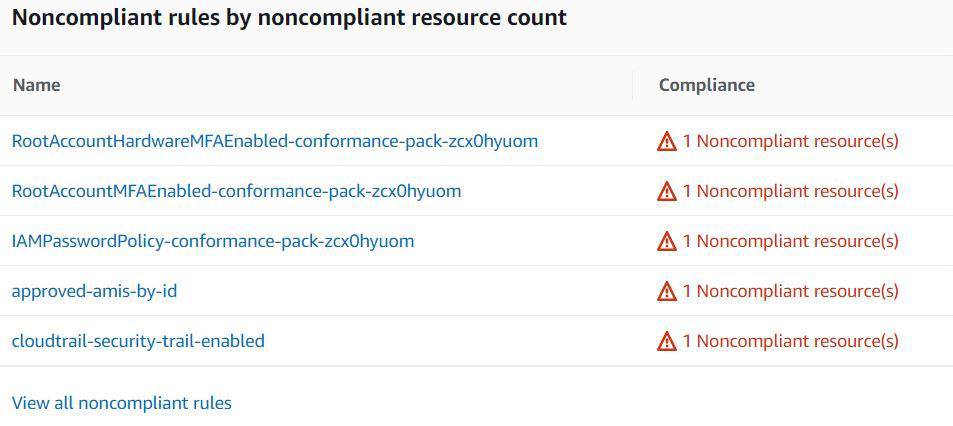
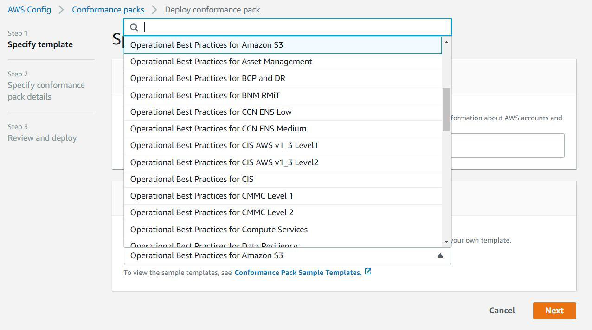

## AWS Config - High Level Overview

AWS Config is primarily used to record the resource configuration changes over time.
An EC2 instance was hosting website from past 90 days. Suddenly in last one week, there
have been a lot of issues with the requests. What was changed?

## Audit and Compliance

AWS Config comes with large set of rules that can continuously monitor your AWS
environment and report the findings.

## Conformance Packs

A conformance pack is a collection of AWS Config rules and remediation actions that can
be easily deployed

## Pricing of AWS Config
knowledge portal
You pay $0.003 per configuration item recorded in your AWS account per AWS Region. A
configuration item is recorded whenever a resource undergoes a configuration change or a
relationship change.
Based on rule evaluation. A rule evaluation is recorded every time a resource is evaluated
for compliance against an AWS Config rule.
You are charged per conformance pack evaluation in your AWS account per AWS Region
based on the tier below.