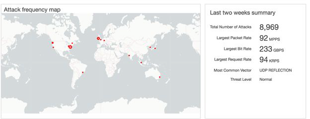
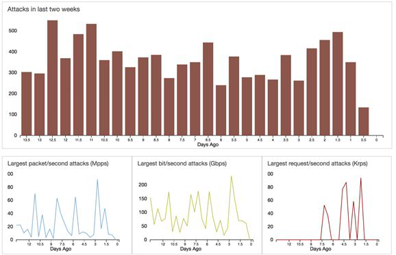

# AWS Shield

## Understanding AWS Shield

AWS Shield is a managed Distributed Denial of Service (DDoS) service that safeguards the
workloads running on AWS against DDoS attacks.
There are two tiers of AWS Shield:
- Shield Standard

- Shield Advanced

## Understanding AWS Shield

AWS Shield standard provides basic level protection against most common network and
transport layer DDoS attacks.
For a higher level of protection, we can subscribe to the Shield Advanced. Shield Advanced
protects against large and sophisticated DDoS attacks with near-real-time visibility into the
attacks that might be occurring.
AWS Shield Advanced also gives customers 24x7 access to the AWS DDoS Response Team
(DRT) during ongoing attacks.

## AWS Shield Costs and Credits

AWS Shield Advanced costs 3000$ per organization and requires Business or Enterprise
Support.
One interesting part about AWS Shield Advanced is that during the attack, if your
infrastructure has scaled, AWS will return you the amount occurred during scaling in the form
of credits. This is also referred to as Cost protection.

