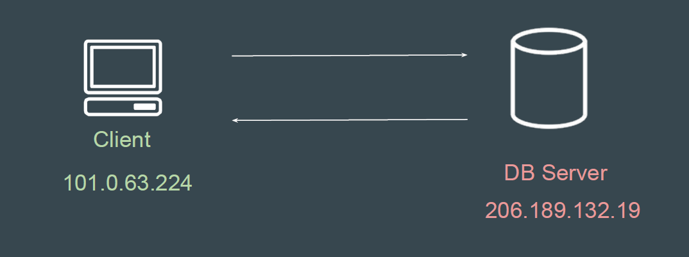
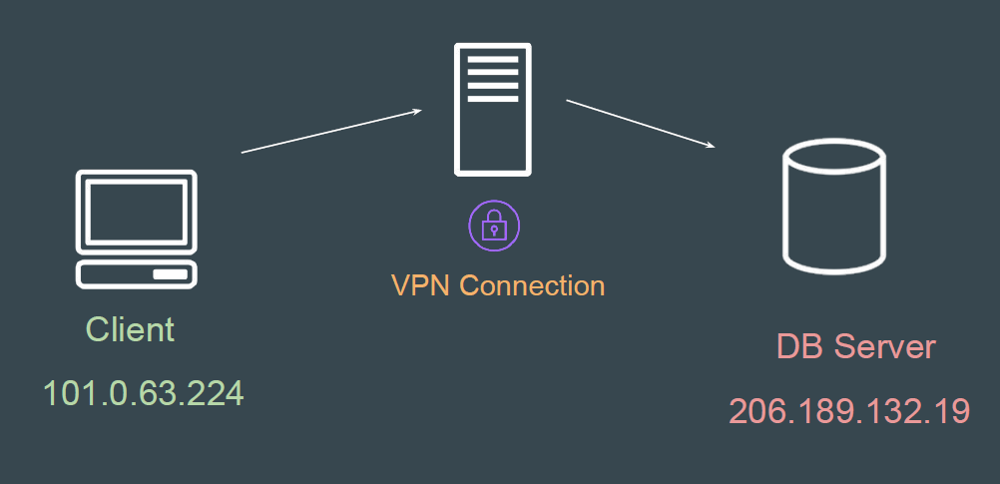
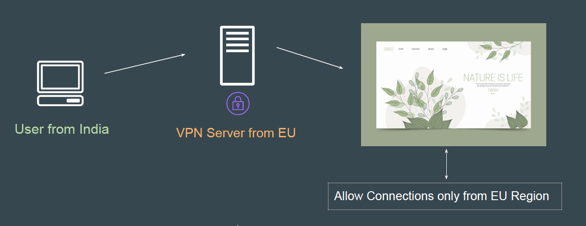
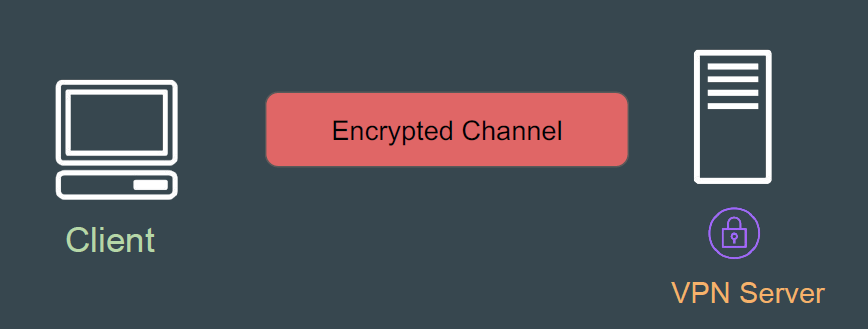

# Virtual Private Networks

## Standard Communication Approach

In the standard approach, the communication between client and server
happens directly without any proxy.

## VPN Based Approach

In this approach, there is a middle-server that essentially proxies the request
from source to destination.

## Standard VPN Usage - Personal Level

At a personal level, VPNs are generally used to bypass geo-restriction filters on
websites.

## VPN And Encryption

VPN is an encrypted connection over the Internet from a device to a network.
It prevents unauthorized people from eavesdropping on the traffic and allows the
user to conduct work remotely.

## VPNs in Corporate Environments

In organizations, most of the servers are in the private subnet where direct
internet connectivity is not allowed.
Users can only connect to them through Organization’s VPN.

