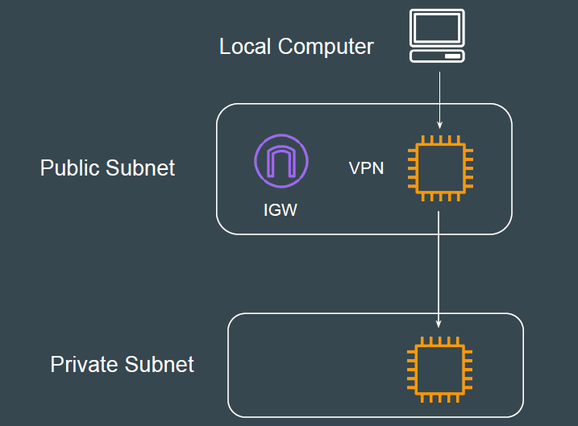
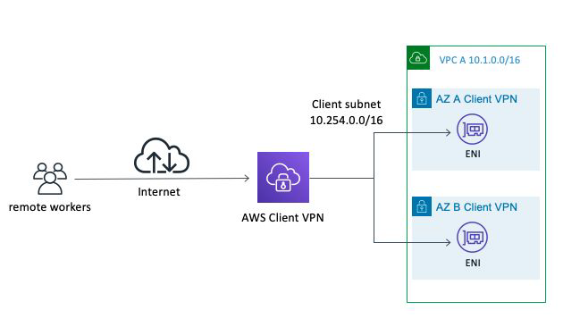

# EC2 Based VPN Architecture

In this approach, you install VPN softwares like OpenVPN in the EC2 instance
and use it to route traffic to private subnets.

Challenges with EC2 VPN Based Architectures

1. High-Availability (What if VPN EC2 goes down)
2. Patch Management.
3. Upgrade of VPN Software
4. Performance Optimization
5. VPN Server Configuration

## AWS Client VPN

AWS Client VPN is a fully-managed remote access VPN solution used by your
remote workforce to securely access resources within both AWS and your
on-premises network

## Benefits of AWS Client VPN

AWS Client VPN is a pay-as-you-go cloud VPN service
Fully elastic, it automatically scales up, or down, based on demand
AWS Client VPN, including the software client, supports the OpenVPN protocol.

