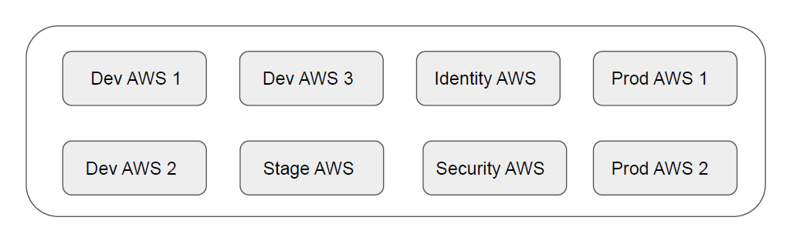
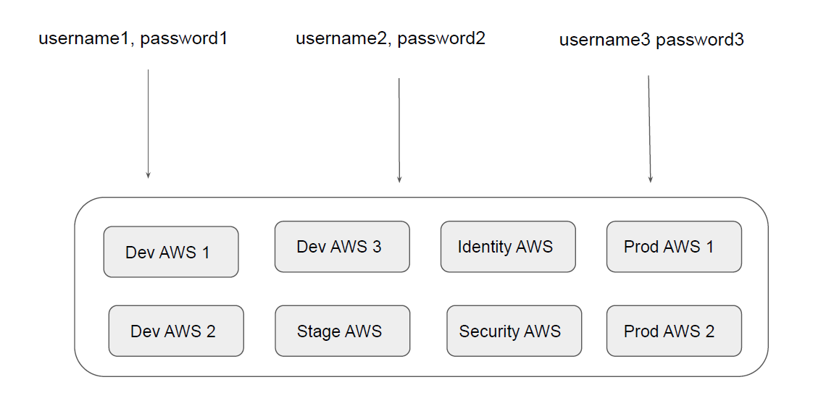
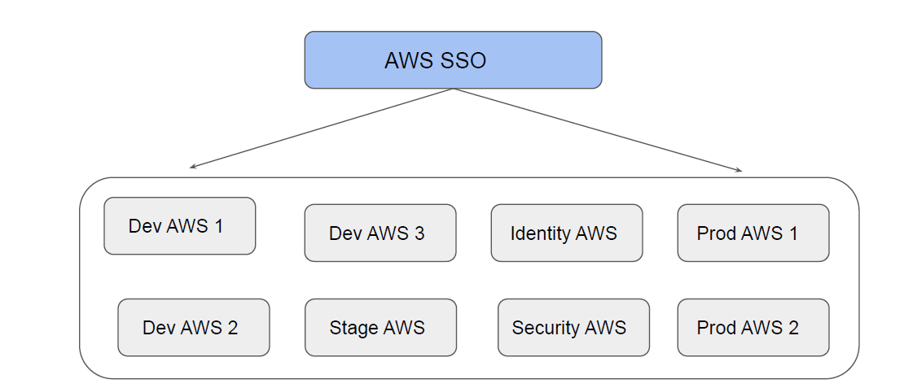
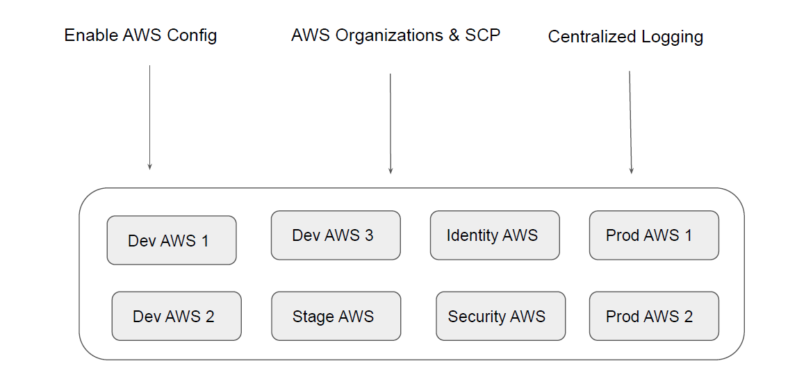
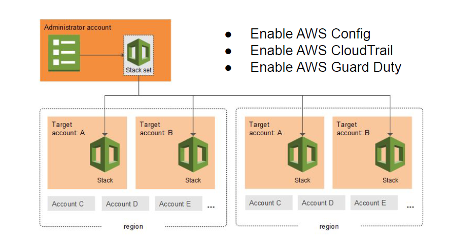
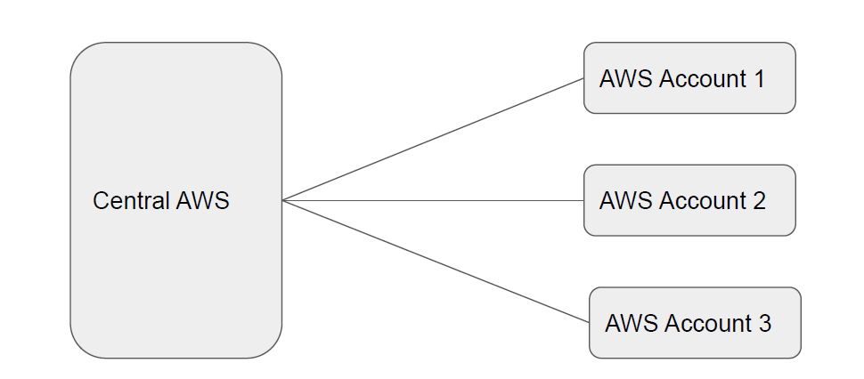
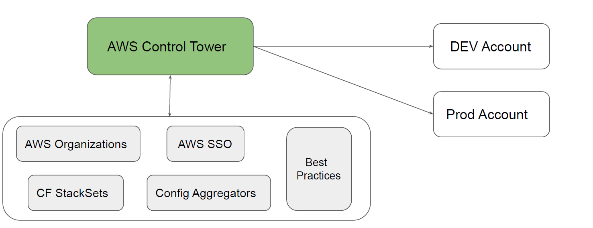
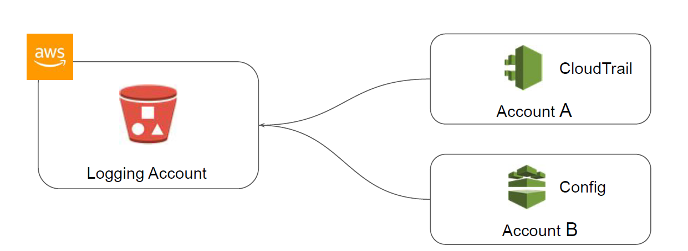

## Challenges with Multi-Account Environments
Most of the organizations follow a multi-account based architecture.
When the amount of AWS account increases, it leads to own set of challenges.

## Challenge 1 - Identity Management

## Solution 1 - Single Sign On

Single sign-on (SSO) is an authentication method that enables users to securely authenticate with
multiple applications and websites by using just one set of credentials.

## Challenge 2 - Security Hardening

## Solution 2 - Security Automation

AWS CloudFormation StackSets allows you to create, update, or delete stacks across multiple
accounts and Regions with a single operation

## Challenge 3 - Centralized Console

We need to have a centralized console that shows details of all AWS accounts, their security
compliance level, and other information

## AWS Control Tower
AWS Control Tower offers a straightforward way to set up and govern an AWS
multi-account environment, following the best practices.

## Centralized Logging

A comprehensive log management and analysis strategy is mission critical in an organization.
It enables the organizations to understand the relationship between operational, security,
and change management events and maintain a comprehensive understanding of their
infrastructure.

