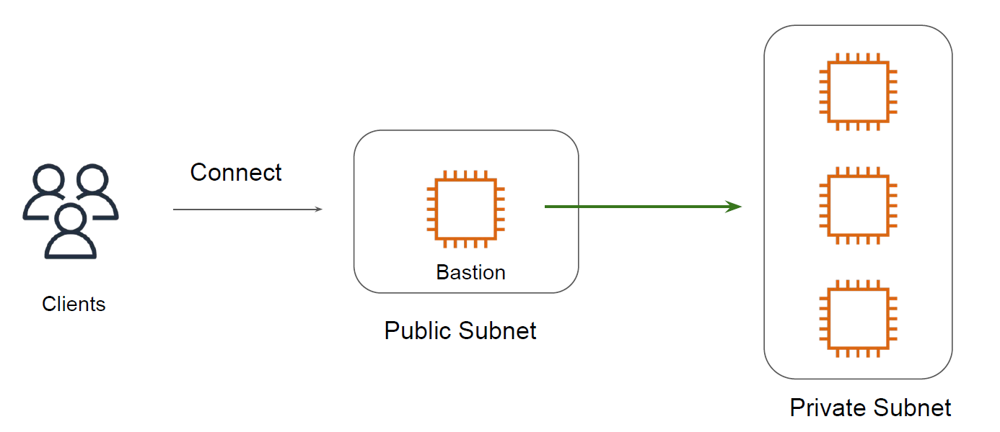
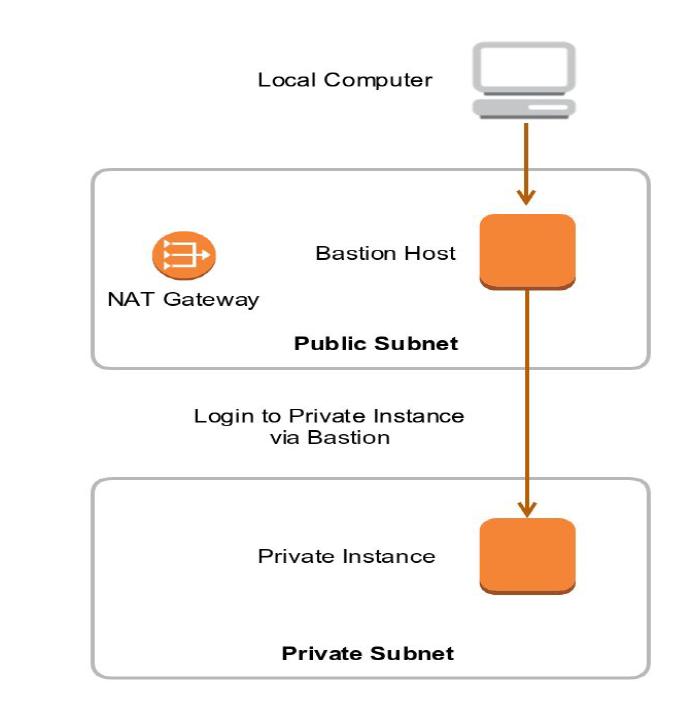
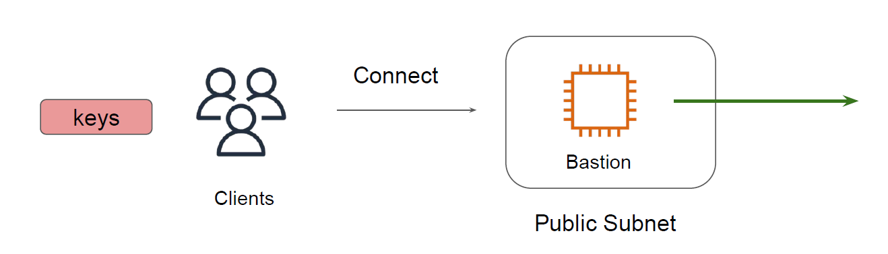
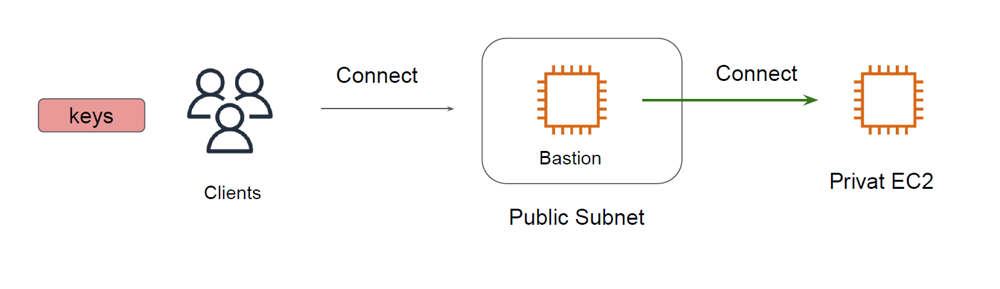

## Basics of Bastion Hosts

Bastion hosts also referred as jump box acts like a proxy server and allows the client
machines to connect to the remote server in the private subnets.

## The Bastion Host

- Bastion Host → “Jump Box” from public to
  private subnet.
- User needs to have access for jump box and the
  private instance.  

 

 

## The Security of Jump Box

- All the unecessary packages should be removed in the Bastion machine to minimize
  the attack surface area.
-  Proper Server Hardening should be applied to the Bastion Host.
-  Private Keys should never be stored on the bastion. We should use “Agent Forwarding”
   for Linux instances.

## Challenge with this Setup

Every user have private keys stored securely on their laptop.
This private key can be used to connect to Bastion Host.
Once logged into Bastion, how will he login to private EC2 instance?

 

 

## SSH Agent Forwarding

SSH Agent forwarding allows users to use their local SSH keys to perform some operation
on remote servers without keys being left from your workstation.

 

