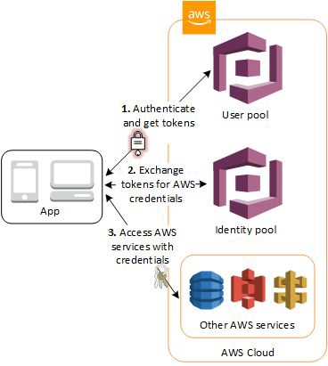
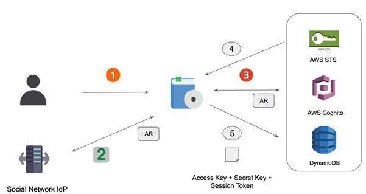
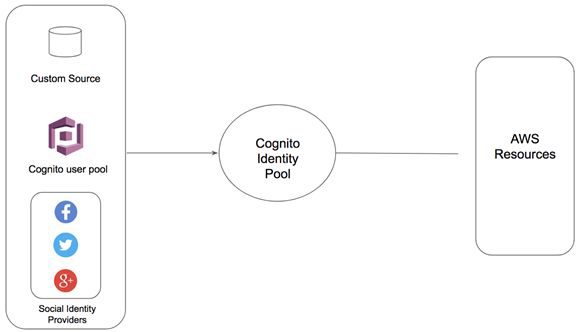

## Basics of Cognito

Amazon Cognito provides authentication, authorization, and user management service for
your web and mobile apps.

## Amazon Cognito

At a high level, there are two major features under Amazon Cognito
i) User Pools
ii) Identity Pools
Cognito user pool takes care of the entire authentication, authorization process .
Identity pool provides the functionality of federation for users in user pools.

## Sample Use-Case

Alice is a mobile developer in a start-up organization. They have begun with mobile wallet
system, and there are specific requirements as follows:
- Users should be able to sign-up with new credentials.

- User should be able to sign-in with social platforms like FB, Twitter, Google.

- There should be a post sign-up process (one-time password) for verification.

- Multi-Factor authentication should be present.

- Account recovery feature should be present.

In-Short: Build a Complete Authentication & Authorization System

## Identity Pool

Cognito Identity pools also referred to as AWS Cognito Federated Identities allows developers
to authorize the users of the application to use various AWS services.
Use-Case:
We have a quiz based mobile application. At the end of quiz, user’s results should be stored in
the DynamoDB table.
If we hard-code the access/secret keys, chances of reverse engineering are high.

## Cognito Identity Pool Working - NO

## User Pool vs Identity Pool - NO

The Cognito Identity pool then takes these identities and federates them and then can give
secure access to the AWS services regardless of where the user comes from.

