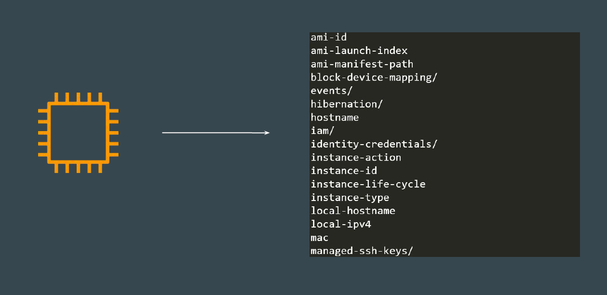
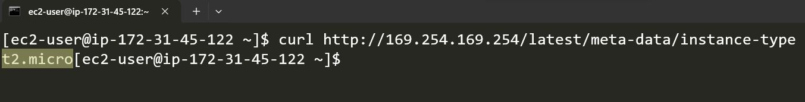

## Understanding the Basics

Instance Metadata is data about your instance.

## Simple Use-Case

Sample Company has a dynamic application that adjusts its resource capacity
based on instance type.
- For T2 based instances, it uses maximum of 50% of the CPU usage.
- For M5 based instances, it uses 100% of the CPU usage.
To run optimally, it needs to automatically identify the instance type of EC2.

## EC2 Instance Metadata to Rescue

Sample Application can send a request to the EC2 Instance Metadata to retrieve
the instance type.
Based on the instance type, it can configure resource usage accordingly.

