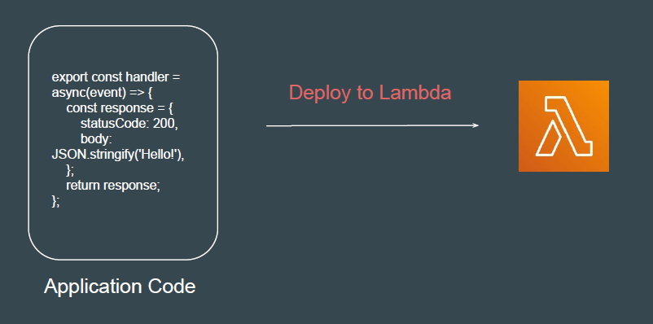

## Understanding the Challenge

There is a requirement to deploy Sample Application for production.
Some of the steps include:

- Provision Servers
- Take care of High-Availability
- Take care of scalability (auto-scaling)
- Configuring application environment
- OS Updates
- Security

AWS Lambda is a *serverless compute service* that lets you run code without
provisioning or managing servers.

## AWS Lambda Limits to Know - per region

- Execution:
    - Memory allocation: 128 MB – 10GB (1 MB increments)
    - Maximum execution time: 900 seconds (15 minutes)
    - Environment variables (4 KB)
    - Disk capacity in the “function container” (in /tmp): 512 MB to 10GB
    - Concurrency executions: 1000 (can be increased)

- Deployment:
    -  Lambda function deployment size (compressed .zip): 50 MB
    -  Size of uncompressed deployment (code + dependencies): 250 MB
    -  Can use the /tmp directory to load other files at startup
    -  Size of environment variables: 4 KB