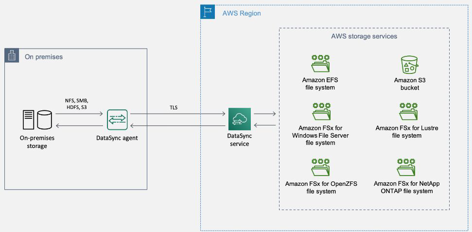

# Understanding the Basics

AWS DataSync is an online data transfer service that simplifies, automates, and
accelerates moving data between storage systems and services.
DataSync provides end-to-end security, including encryption and integrity
validation, to help ensure that your data arrives securely, intact, and ready to
use.

## Supported Endpoints
DataSync can copy data to and from:

- Network File System (NFS) file servers
- Server Message Block (SMB) file servers
- Hadoop Distributed File System (HDFS)
- Object storage systems
- amazon Simple Storage Service (Amazon S3) buckets
- Amazon EFS file systems
- Amazon FSx for Windows File Server file systems
- Amazon FSx for Lustre file systems
- Amazon FSx for OpenZFS file systems
- Amazon FSx for NetApp ONTAP file systems
- AWS Snowcone devices
- Google Cloud Storage buckets
-  Azure Files

# Transferring between on-premises storage and AWS

## Transferring between AWS storage services

## Transferring data from Google Cloud Storage to Amazon S3

1. You deploy a DataSync agent in your Google Cloud environment.
2. The agent reads your Google Cloud Storage bucket
3. Objects from your Google Cloud Storage bucket move securely through TLS 1.2 into
   the AWS Cloud by using a public endpoint.
4. The DataSync service writes the data to your S3 bucket.

