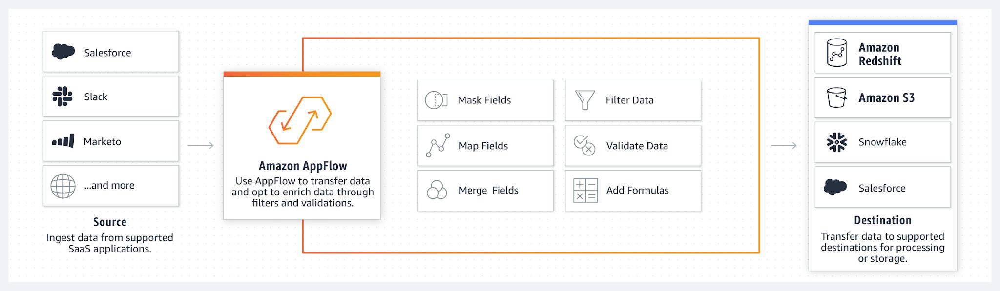

Amazon AppFlow is a fully managed integration service that helps you securely
transfer data between SaaS applications such as Salesforce, Google Analytics
and AWS services such as Amazon Simple Storage Service (S3) and Amazon
Redshift in a few selections.

