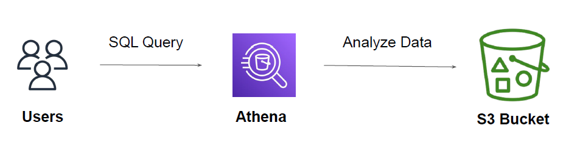

Amazon Athena is service that allows us to analyze various log files from a data source using
standard SQL

## Approach Before Athena

You have CloudTrail logs in S3 and you want to see who has logged in, in the past 10 days.

- Create EC2 instances.
- Deploy monitoring stack like Splunk, ELK or others.
- Add the data source from S3 to import CloudTrail logs.
- Begin Analyzing.